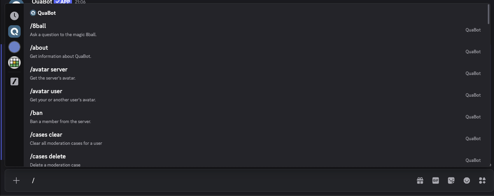

# Commands

QuaBot uses slash commands. No more struggling with `!kick @user` and then getting 38 different errors each time. Just type `/` and see all the commands that you can use, with the required options ready to use. On this page you will find the full list of commands and some information about enabling/disabling certain commands.

## Disabling or restricting certain commands

There are a couple of ways to restrict commands. You can use [the QuaBot Commands Page](./getting-started.md#commands-page) to completely disbable certain commands for everyone, including administrators. You can also [change the permissions](./permissions.md) to disable commands for a few roles or users

## Commands overview

:::note
This list of commands is incomplete. You can find a full list of commands by using the `help` command.
:::

| Command                      | Options                                     | Description                                         |
| ---------------------------- | ------------------------------------------- | --------------------------------------------------- |
| /8ball                       | question                                    | Ask a question to the magic 8ball.                  |
| /about                       | –                                           | Get information about QuaBot.                       |
| /avatar server               | –                                           | Get the server's avatar.                            |
| /avatar user                 | user                                        | Get your or another user's avatar.                  |
| /ban                         | user, reason, delete_message_days, duration | Ban a member from the server.                       |
| /cases clear                 | user                                        | Clear all moderation cases for a user.              |
| /cases delete                | case-id                                     | Delete a moderation case.                           |
| /cases edit                  | case-id                                     | Edit a moderation case.                             |
| /cases list                  | user, user-id, type, moderator, active      | List all moderation cases (with filtering options). |
| /cases revoke                | case-id                                     | Revoke a moderation case.                           |
| /cases user                  | user                                        | List all moderation cases for a specific user.      |
| /cases view                  | case-id                                     | View a moderation case.                             |
| /clear                       | amount                                      | Clear messages from a channel.                      |
| /coinflip                    | –                                           | Flip a coin.                                        |
| /dashboard                   | –                                           | Get a link to the QuaBot dashboard.                 |
| /giveaway create             | prize, winners, duration, channel           | Create a giveaway.                                  |
| /giveaway end                | giveaway_id                                 | End a giveaway.                                     |
| /giveaway list               | –                                           | List all active giveaways.                          |
| /giveaway reroll             | giveaway_id                                 | Reroll a giveaway.                                  |
| /help                        | module                                      | Get a list of QuaBot commands.                      |
| /info bot                    | –                                           | Displays information about QuaBot.                  |
| /info server                 | –                                           | Displays information about the server.              |
| /info user                   | user                                        | Displays information about you or another user.     |
| /invite                      | –                                           | Invite QuaBot to your server.                       |
| /kick                        | user, reason                                | Kick a member from the server.                      |
| /lockdown channel            | channel, duration, reason                   | Lockdown a channel.                                 |
| /lockdown server             | duration, reason                            | Lockdown the entire server.                         |
| /members                     | –                                           | Get the server's member count.                      |
| /ping                        | –                                           | Get the bot's latency.                              |
| /premium                     | –                                           | Get information about QuaBot Premium.               |
| /rps                         | –                                           | Play Rock Paper Scissors.                           |
| /softban                     | user, delete_message_days, reason           | Ban and instantly unban to delete messages.         |
| /softlock channel            | channel, slowmode, duration, reason         | Softlock a channel.                                 |
| /softlock server             | slowmode, duration, reason                  | Softlock the entire server.                         |
| /suggestion approve          | suggestion_id, message_id, reason           | Approve a suggestion.                               |
| /suggestion blacklist-add    | user, reason                                | Blacklist a user from suggestions.                  |
| /suggestion blacklist-remove | user                                        | Remove a user from the suggestion blacklist.        |
| /suggestion create           | –                                           | Create a suggestion.                                |
| /suggestion delete           | suggestion_id, message_id, reason           | Delete a suggestion.                                |
| /suggestion deny             | suggestion_id, message_id, reason           | Deny a suggestion.                                  |
| /suggestion downvotes        | suggestion_id, message_id                   | View all downvotes (premium only).                  |
| /suggestion queue            | –                                           | Review the suggestion queue.                        |
| /suggestion upvotes          | suggestion_id, message_id                   | View all upvotes (premium only).                    |
| /support                     | –                                           | Get help and support for QuaBot.                    |
| /timeout                     | user, duration, reason                      | Timeout a member.                                   |
| /unban                       | user-id, reason                             | Unban a user.                                       |
| /unlock channel              | channel                                     | Unlock a locked channel.                            |
| /unlock server               | –                                           | Unlock the entire server.                           |
| /untimeout                   | user, reason                                | Remove a timeout.                                   |
| /voice deafen                | user                                        | Deafen a user in voice channels.                    |
| /voice kick                  | user                                        | Kick a user from a voice channel.                   |
| /voice move                  | user, channel                               | Move a user to another voice channel.               |
| /voice move-all              | channel                                     | Move all users to another voice channel.            |
| /voice move-current-channel  | channel                                     | Move everyone from your current channel.            |
| /voice mute                  | user                                        | Mute a user in voice channels.                      |
| /vote                        | –                                           | Vote for QuaBot.                                    |
| /warn                        | user, reason, duration                      | Warn a member in the server.                        |
| /ticket add                  | user                                        | Add a user to a ticket.                             |
| /ticket add-role             | role                                        | Add a role to a ticket (staff only).                |
| /ticket claim                | –                                           | Claim a ticket.                                     |
| /ticket close                | –                                           | Close a ticket.                                     |
| /ticket close-request        | –                                           | Send a close request to the ticket owner.           |
| /ticket create               | –                                           | Create a ticket.                                    |
| /ticket delete               | –                                           | Delete a ticket.                                    |
| /ticket escalate             | –                                           | Escalate a ticket to another panel (staff only).    |
| /ticket feedback             | –                                           | View ticket feedback statistics.                    |
| /ticket info                 | ticket                                      | Get information about a ticket.                     |
| /ticket remove               | user                                        | Remove a user from a ticket.                        |
| /ticket remove-role          | role                                        | Remove a role from a ticket (staff only).           |
| /ticket rename               | name                                        | Rename a ticket (staff only).                       |
| /ticket reopen               | –                                           | Reopen a ticket.                                    |
| /ticket setup                | –                                           | Setup the tickets module.                           |
| /ticket stats                | ticket                                      | Get various statistics about a ticket.              |
| /ticket topic                | topic                                       | Change the ticket topic.                            |
| /ticket transcript           | ticket                                      | Generate a transcript of a ticket.                  |
| /ticket transfer             | –                                           | Transfer a ticket to another panel (staff only).    |
| /ticket unclaim              | –                                           | Unclaim a ticket.                                   |
