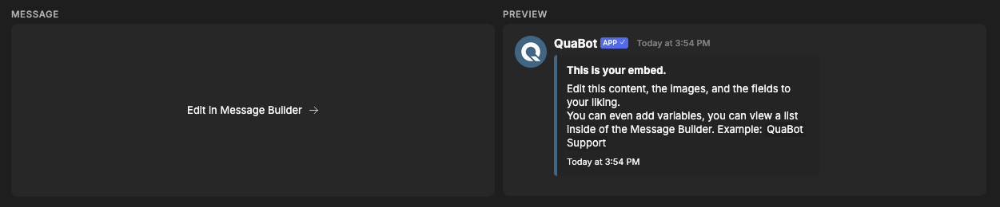
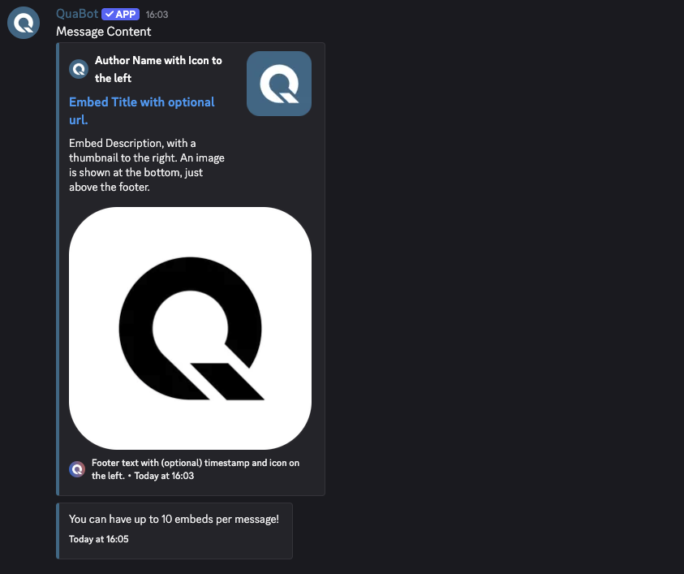
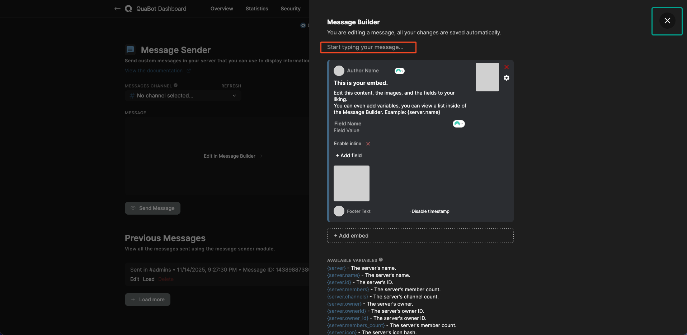
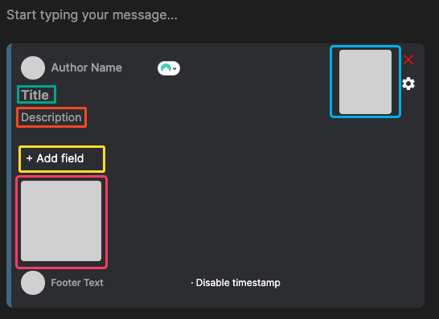
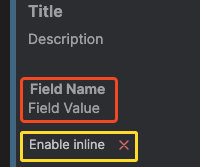
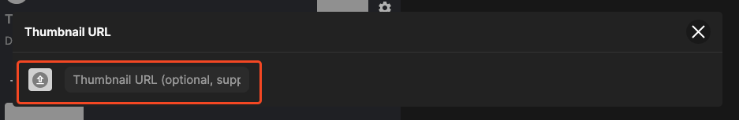
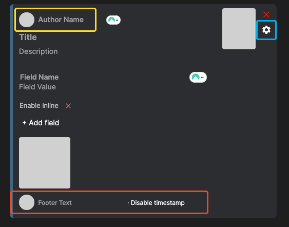
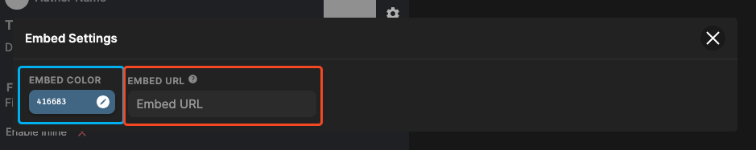
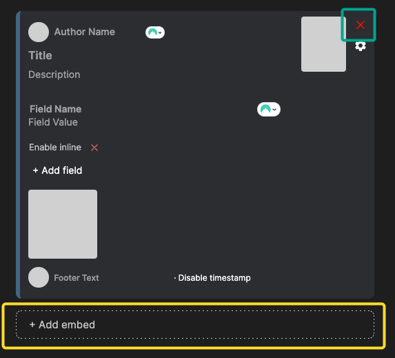
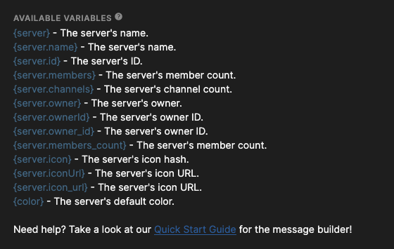

# Message Builder

The Message Builder is a powerful tool that lets you create polished, fully customized Discord embeds for nearly every module. This page walks you through the interface, explains each feature, and answers frequently asked questions.

## Overview

The Message Builder consists of two main sections:

- **Left side:** A button that opens the editor (“Edit in Message Builder”).
- **Right side:** A live preview of your message. Any changes you make are updated instantly in the preview. (You still need to save the whole module afterwards.)

## Discord Messages and Their Limits

A Discord message consists of multiple parts, each with its own limitations:

### **Message**

- **Message Content:** Text above all embeds. Supports markdown. Max 2000 characters.
- **Embeds:** Up to 10 embeds per message, with a combined total of 6000 characters.
- **Components:** Optional buttons, menus, etc.

### **Embeds**

- **Title:** Up to 256 characters.
- **Title URL:** Optional URL (only if a title is set).
- **Description:** Up to 4096 characters, supports multiline and markdown.
- **Timestamp:** Shows the embed’s date.
- **Color:** The colored bar on the left side.
- **Footer:** Optional icon, text (max 2048 chars), and optional timestamp.
- **Image:** Full-width image at the bottom.
- **Thumbnail:** Small image on the right.
- **Author:** Icon, text, and optional URL. Max 256 characters.
- **Fields:** Up to 25 fields.
  - Field name: max 256 characters
  - Field value: max 1024 characters (markdown supported)
  - Inline fields are displayed in rows of up to 3.

## Editing a Message

Clicking **“Edit in Message Builder”** opens the editing popup.

- **Green outline:** Close button (returns to preview).
- **Red outline:** Message content editor — type directly into it.

Below the content area, you will see the embed list. Each embed can be edited or deleted individually.

---

## Editing an Embed

### Basics

- **Title (green):** Click to edit.
- **Description (red):** Markdown supported.
- **Fields (yellow):**
  - Click **Add Field** to create one.
  - Enter field name + value.
  - Toggle inline mode. (Display next to each other)
  - Remove a field using the red X.

- **Image & Thumbnail:**

  - Click the gray image areas to upload or enter a URL.
  - Thumbnail = right side (blue outline)
  - Image = bottom (pink outline)
  - Both support variables (see “Using Variables”).
  - The popup shown below will open, use the upload icon to upload an image and enter a url in the field to enter a variable or custom URL.

### Advanced Features

- **Author (yellow):**  
  Click the icon to upload or enter an icon URL; edit the text next to it.

- **Footer (red):**  
  Upload an icon and add footer text.  
  Toggle timestamp on/off.

- **Color (blue) & Title URL (red):**  
  Click the settings icon to open the advanced popup:  
  

---

## Adding & Removing Embeds

- Use **“Add Embed”** (yellow) to create a new embed.
- Click the **red X** (green) in the top-right of an embed to delete it immediately.

---

## Using Variables

If the module supports variables, a list will appear below the embeds. Variables insert live server/user data into your message.

**Example:**  
`Welcome to {server.name} {user}! You are the {members}th member!`  
becomes  
`Welcome to QuaBot Server @Username! You are the 50th member!`

Variables also work for image fields (e.g., user avatars, server icons).

If a variable doesn't preview correctly, it will still work in Discord. Our preview renderer is continuously improving.

---

## Frequently Asked Questions

### **What is an embed?**

You can read the full explanation above in the section [**Discord Messages and Their Limits**](#discord-messages-and-their-limits).

### **Why does the preview show incorrect data?**

The website doesn't have access to the bot’s real-time data. Variables will be accurate only in your Discord server.

### **Markdown doesn’t fully render in the preview — will it still work?**

Yes. The preview only supports:

- **Bold**
- _Italic_
- ~~Strikethrough~~
- `Code`
- ||Spoilers||

All other markdown will work normally in Discord - it won't show up on the preview.

### **A variable isn’t showing correctly in preview — is it broken?**

Likely not. It should still work in the final message. If not, please contact us on [Discord](https://discord.quabot.net).

---

## Need help?

Visit our [Discord server](https://discord.quabot.net)! Our support team is ready to assist you.

---
