# Getting Started

### Adding QuaBot to your server

Before you can use QuaBot, you need to add it to your server! You can do that with the following url: [invite.quabot.net](https://invite.quabot.net) or the direct [Discord Invite](https://discord.com/oauth2/authorize?client_id=1410349992794787850&scope=bot%20applications.commands&permissions=395607272542&response_type=code&redirect_uri=https%3A%2F%2Fquabot.net%2Flogin%3Forigin%3D%2Fdashboard). You will see the following screen:

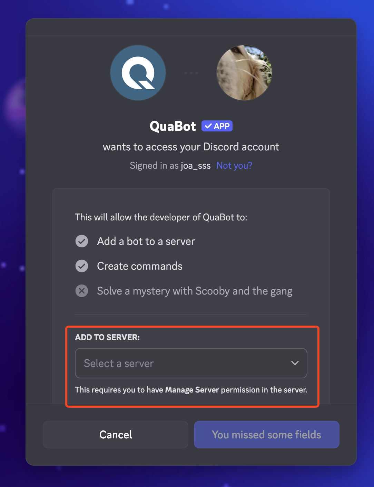

You can select the server you want to add QuaBot to with the server selector outlined above.

:::info Required Permissions
In order to add a bot to your server, you need either the **Manage Messages** or **Administrator** permissions.
:::

After selecting your server and clicking continue, you will see a full list of permissions you will grant QuaBot. QuaBot needs all of these (except for Administrator, but it prevents issues later on if the bot has admin - you can of course remove it since the bot can do everything with Administrator), so make sure it has them all. You then click Authorize, and the bot is in your server!

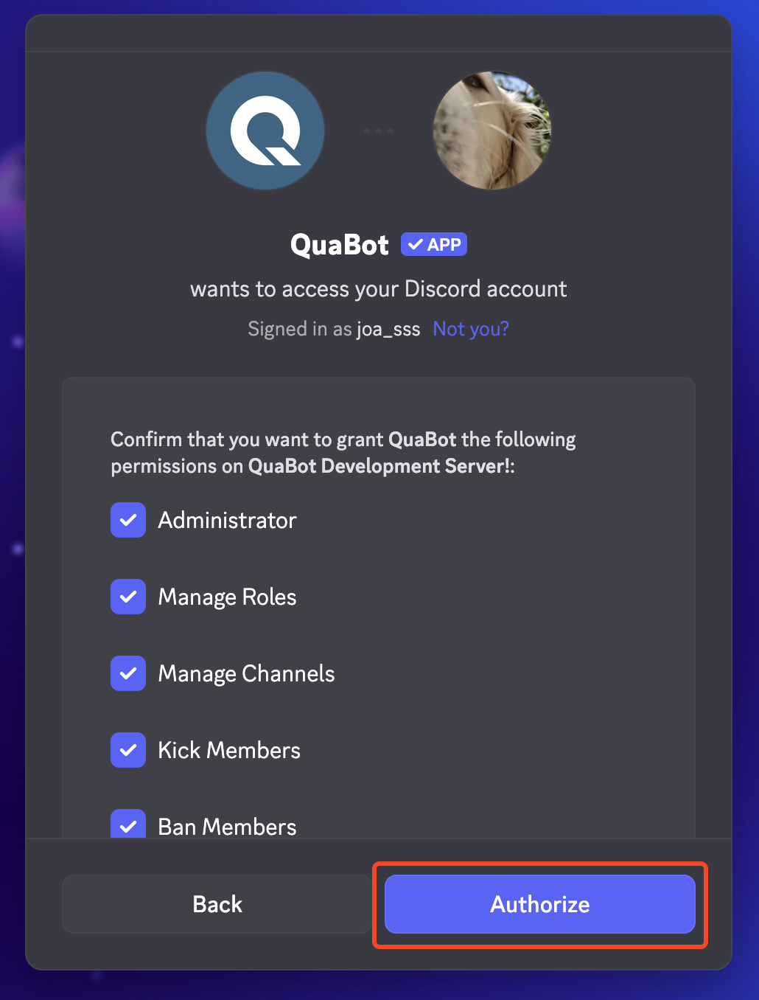

#### Logging in to the dashboard

You are then redirected, and prompted to authorize again. This is to login to the QuaBot dashboard. You will see a list of things the bot will be able to see. Click authorize again, and you will be logged in to the QuaBot Dashboard.

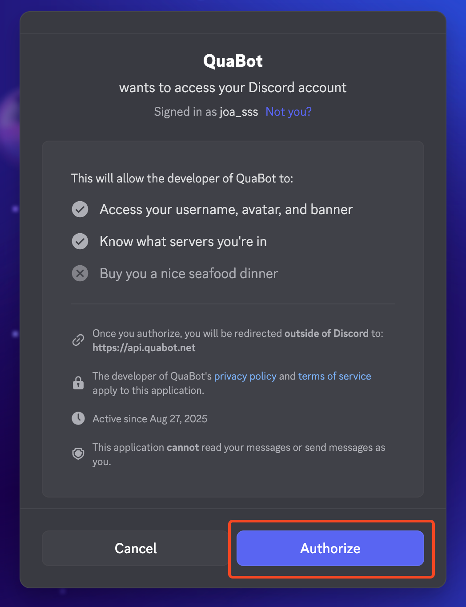

### Logging in to the QuaBot dashboard

If you added QuaBot with the guide above, you are already logged in. The dashboard keeps you logged in, and you do not have to log in again. If you are not logged in yet, you can do the following:

1. Go to https://quabot.net and click login in the top right.

   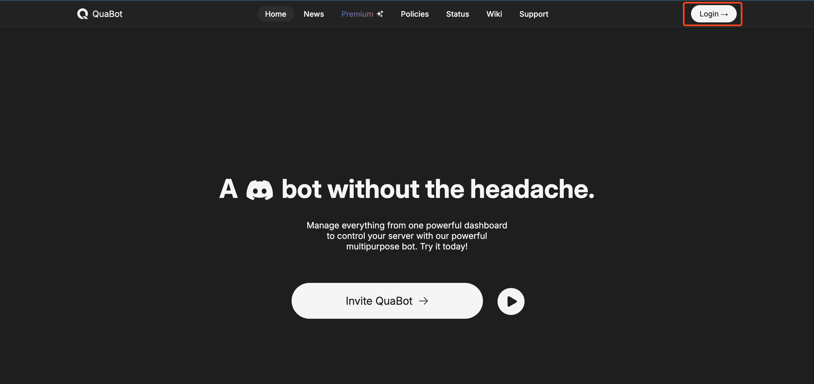

2. Follow the authorization steps as outlined [above](#logging-in-to-the-dashboard).
3. You will see the server overview page. We will go into that page in more detail.

   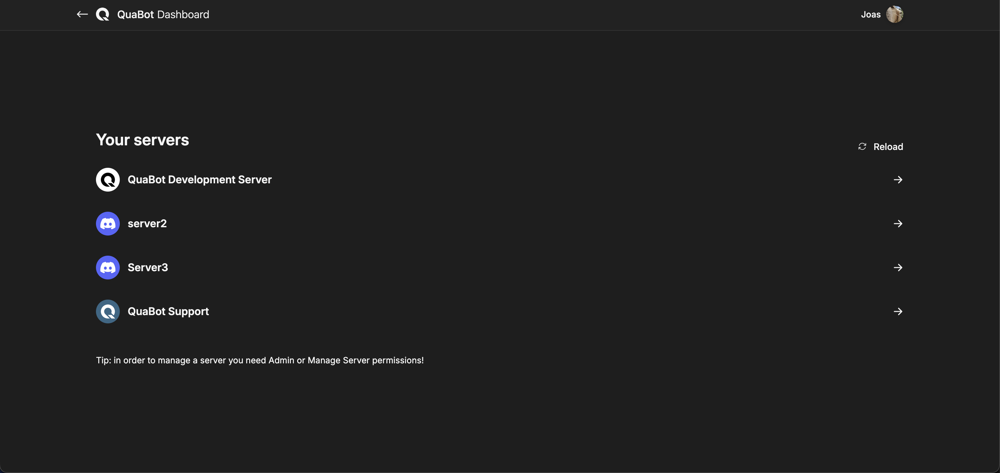

### Selecting a server

After you have logged in to the dashboard you will see the following page:

It might look different for you, with more or less servers but should be generally the same.

:::info Required Permissions
In order to configure a server you're in, you need either the **Manage Messages** or **Administrator** permissions.
:::

If your server does not show up, Reload the server list with button. (outlined in red below)
You can select the server you want to configure by clicking on it (as outlined in green below)

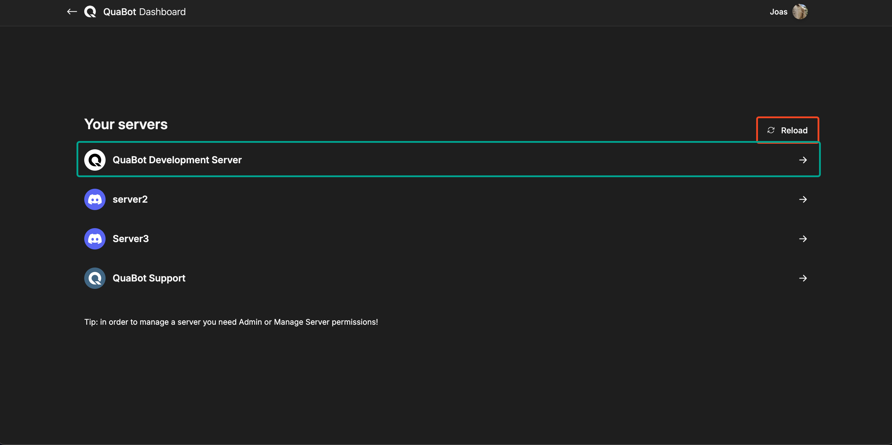

If the bot is not in the server yet, you will now be redirected to the invite screen. Otherwise you will see the Dashboard. We will explain each item on this page in detail below.

## Overview of the dashboard

Once you have selected a server, you are on the Overview page of the QuaBot dashboard. In the next section of this article, we will explain each page and section of the dashboard. Starting with Navigating the dashboard.

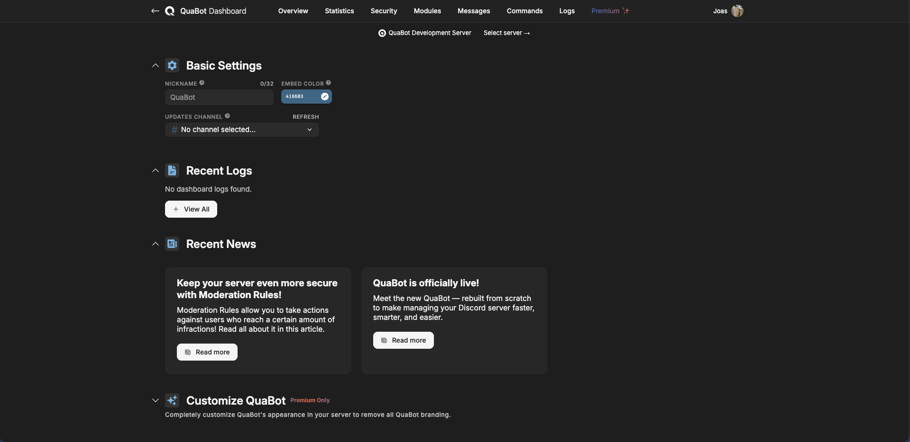

### Navigating the dashboard

There are a couple of ways to navigate around the dashboard. In the image below each method is outlined with a different color, and we will go over each of them and explain what they do.

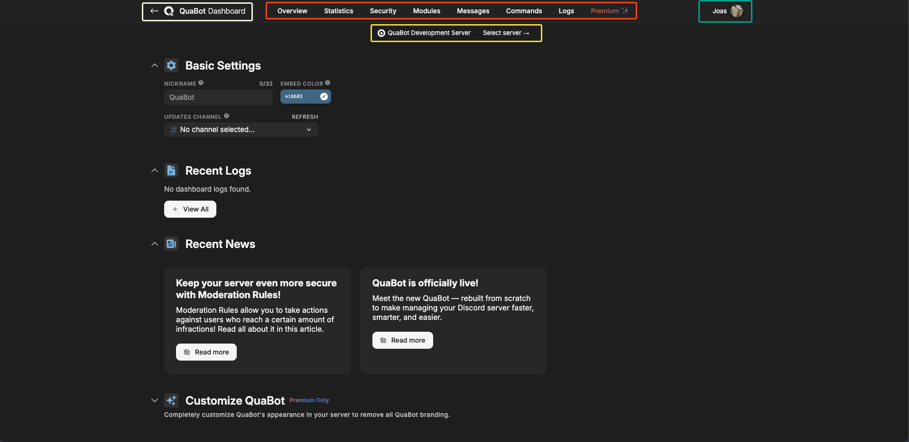

1. Using the **QuaBot Dashboard Logo** (outlined in white), you can return to the main QuaBot site by clicking on the part of the logo that just says "QuaBot". Clicking on the "Dashboard" text opens the Server Selection page. The arrow to the left returns you to the next page (if there is one). This is always visible.
2. Using the **tabs** (outlined in red), you can navigate to the different tabs of the dashboard. These are always visible. We will go over each of these tabs later. When you are on one of these tabs they have a different color to differentiate them. (As seen on the "Overview" tab)
3. Clicking on your **Username** in the top right (outlined in green), you can open a dropdown with some additional settings. You will see the user you are logged in as, you can select a different theme (Light, Dark, Dark (Light) and Dark (blue)). You can directly visit the wiki (in a new tab), and log out of the dashboard. An example is shown below. This tab is always available, as long as you are logged in.

   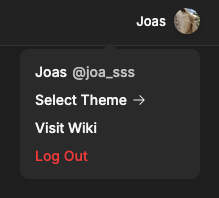

4. Using the **Select Server** bar (outlined in yellow), you can easily see what server you are configuring at this time. You can also easily go back to the server selection page. This bar is only visible when a server is selected, so not on the Servers page.

Hopefully this made you understand how to navigate the QuaBot dashboard. Next up, we'll take a look at each of the tabs.

### Overview Page

The overview page is the page you can view as the hub of the QuaBot dashboard, or the general settings. You can configure everything from the Bot's username, updates channel and more. We will go over each 'Section' in detail below.

#### Basic Settings

- Nickname: You can use this to change QuaBot's nickname in the server.
- Embed Color: Use this to change the color of the embeds the bot sends. It applies to the color to the left edge of the message embeds. (example below)

  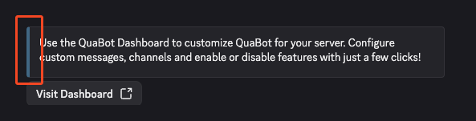

- Updates Channel: QuaBot might occisionally send messages to this channel regarding major bot updates, big changes or premium-related status updates. We only send a few messages per year, so don't expect any spam from us.

#### Recent Logs

Shows a list of the last few [Dashboard Logs](#logs-page) with the ability to view them all.

#### Recent News

Shows 3 of the newest news articles for you to read. These are mostly about bot updates or future updates and changes.

#### Customize QuaBot (Premium only)

- QuaBot Avatar: Choose a custom Bot avatar (will be reverted if premium access is removed). This will only apply to your server.
- QuaBot Banner: Choose a custom banner (will be reverted if premium access is revoked). This will only apply to your server.
- QuaBot About me: Set a custom short description that appears on the bot's profile for your server. Up to 190 characters.
- Embed Footer: Update the avatar and text shown on the embed footers for QuaBot. (example below)
  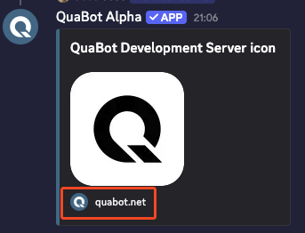

#### Reset Settings

Use the options here to reset QuaBot to original settings (only use this if you know what you're doing). This breaks active configuration and is not recommended! Cannot be reverted, not even by our developers or support team.

### Statistics Page

You can read all about statistics on the [Statistics Page](./modules/statistics.md).

### Security Page

You can read all about security on the [Security Overview Page](./security/security-overview.md).

### Modules Page

- On the modules page you will find a full list of modules that you can use and configure for QuaBot. You can begin configuring a module by pressing the **Configure button** (outlined in red). You will then be taken to the configuration page for that modules. Read more about each module [here](./category/modules).
- You can press the **icon** for each module (outlined in green) to enable or disable them. When a module is black/white it's disabled, if it has color it's enabled.
- You can filter and sort the modules with the **Filter Icon** (outlined in yellow). You can sort based on alphabetical order, popularity and more.
- You can search through the list of modules with the **Search Bar** (outlined in purple).

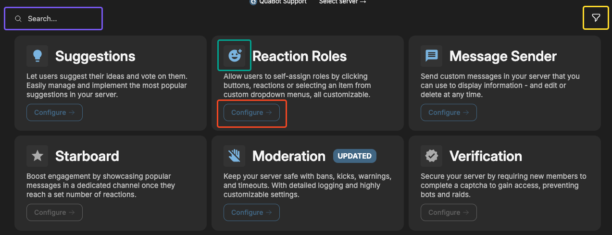

### Commands Page

On the commands page you will be met with a list of every command (including subcommands: ` /` `[command] ` `[subcommand]`). You can enable and disable commands here. Once you have enabled or disabled your list of commands, don't forget to save your changes! If a command is disabled, nobody on your server can use it, not even administrators. If you wish to disable a command for only a select group of users, or for a specific role view the [Permissions Page](./permissions.md).

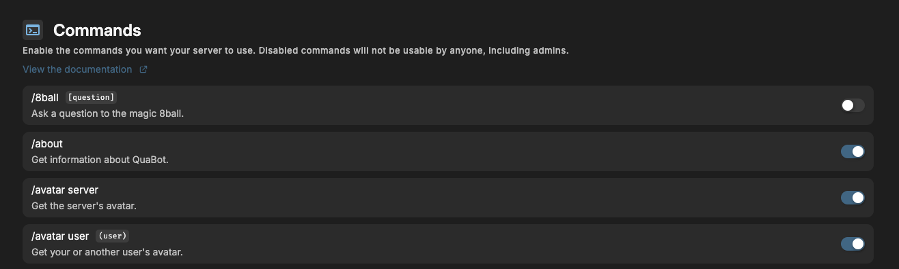

### Messages Page

The Messages page allows you to send customized messages to any channel in your server, that you can alway edit later on.

#### Sending a messsage

1. You select a channel with the selector outlined in red. It needs to be a valid text channel.
2. You customize your message with the Message Builder below the channel picker. More info about the Message Builder [can be found on the dedicated page for it](./embed-builder.md).
3. If it is valid, the "Send Message" button outlined in yellow becomes clickable. Upon clicking it, the message is sent to your server.
   If the message is invalid, an error alert will show up at the top of the site.

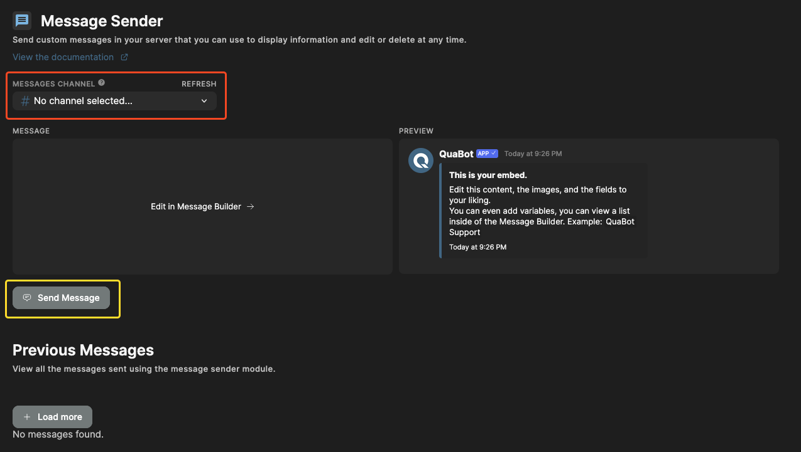

#### Editing a message

Once you have sent your messsage, a new entry gets added to the "Previous Messages" section. You have 3 options, edit, load and delete.

- **Edit**: Loads the message in the Message Builder and allows you to edit the message in the channel. When you're ready, press "Edit Message" (in place of the Send button) and your message is edited. The edited message is saved as the previous message for the next time you wish to edit it.
- **Load**: Loads the message in the Message Builder to be sent. This does not allow you to edit the message, only to resend it (edited or not) in a different channel, not updating the existing one.
- **Delete**: Deletes the message in the "Previous Messsages" section and in the channel.

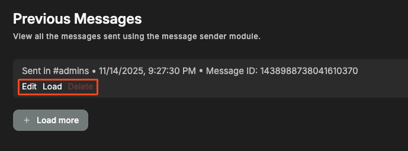

### Logs Page

The Dashboard Logs log most of the actions and settings that are changed for the bot on your server. It shows the person that made the edit and what they changed. Helpful if any malicious edits or changes are made, you can see exactly who made said change!

Some logs have multiple actions, in which case there is an arrow (as outlined in red below) to expand the log to show a list of changes.

If you've reached the bottom of the list, you can use the button ("Load More") outlined in yellow to load the next batch. Once the button gets disabled you've reached the bottom.

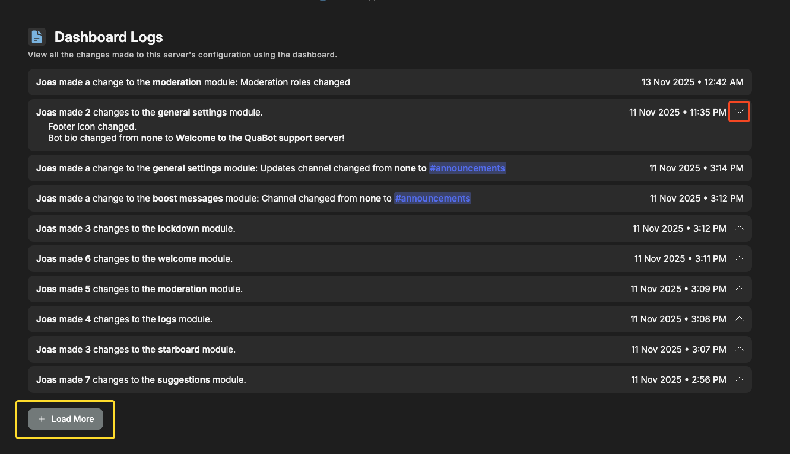

That's it! You're ready to get started using QuaBot. View the sidebar for more information about [Permissions](./permissions.md), [Commands](./commands.md) or to view the [Modules](./category/modules). If you have any questions, please ask in our [support server](https://support.quabot.net).
