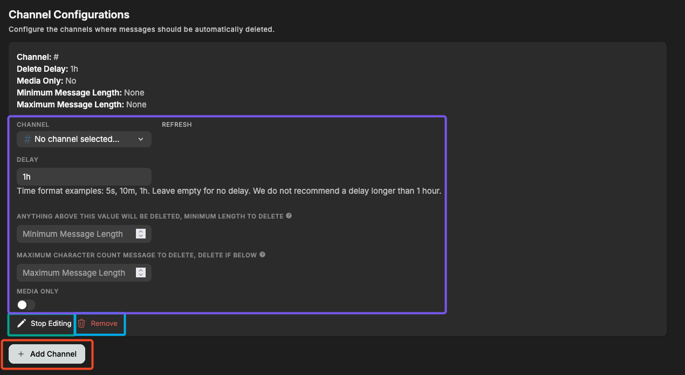

# Auto Delete Messages

## Introduction

Auto Delete Messages automatically cleans up selected channels based on rules you define.  
Use it to keep busy channels tidy, remove spammy short messages, clear media-only posts, or enforce message length rules.

You can configure:

- **Delay:** How long a message should stay before being deleted (e.g. `1h`, `10m`, `30s`).
- **Minimum length:** Delete messages _below_ a certain character count.
- **Maximum length:** Delete messages _above_ a certain character count.
- **Media-only:** Delete only messages containing attachments or media.

## Setup

Above is the main configuration screen for Auto Delete Messages.

- **Add Channel** (red): Add a channel to the auto-delete list.
- **Start/Stop Editing** (green): Open the editor for that channel.
- **Remove** (blue): Remove the configuration for that channel.

## Editing a Channel

When you click **Start Editing**, you can set:

### **Delay**

How long the bot should wait before deleting a message.

Examples:

- `30s`
- `5m`
- `2h`

### **Minimum Length**

Delete messages **longer** than this value.  
Useful for channels that should only contain short comments.

### **Maximum Length**

Delete messages **shorter** than this value.  
Useful for removing spam like “?”, “hi”, “ok”, or emojis.

### **Media Only**

If enabled, only deletes messages that contain:

- Images
- Videos
- Attachments
- Etc.

## Frequently Asked Questions

### **Do pinned messages get deleted?**

Yes. Pinning a message does not exclude it.

### **Does the bot delete its own messages?**

Yes, all messages are deleted if they meet the criteria.

### **Does this work with threads?**

No, only main channel messages are filtered.

### **Does deleting messages log them?**

If you have Action Logs enabled, deletions will appear there.

---
