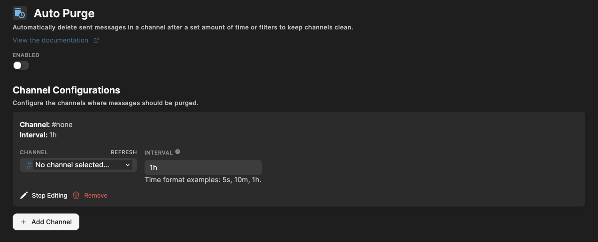

# Auto Purge

Automatically purge messages in a channel on an interval to keep channels empty.

## Introduction

Auto Purge automatically removes **all messages** in selected channels after a fixed amount of time.  
It’s perfect for channels that should regularly reset themselves, such as:

- Bot command channels
- Support queues
- Temporary chat channels
- Media‑only or spam‑heavy channels

Unlike **Auto Delete Messages**, Auto Purge does _not_ filter messages based on length or attachments — it simply deletes **every message** after the configured interval.

## How It Works

You select a channel and choose how often it should be cleared. Once the time has passed, the bot will purge the channel.

### Example

- Interval: **1h**  
  → Every hour al messages are deleted.
- Interval: **10m**  
  → Clean flush of all messages every 10 minutes.
- Interval: **24h**  
  → Channel resets daily.

## Time Format

The interval accepts short, simple time formats:

| Format | Meaning    |
| ------ | ---------- |
| `10s`  | 10 seconds |
| `5m`   | 5 minutes  |
| `1h`   | 1 hour     |
| `24h`  | 24 hours   |

You can only use a single value (e.g., `1h`), not combinations like `1h 30m`.

## Configuring Auto Purge

The Auto Purge module contains the following settings and options:

### Enabled

Toggle the entire module on or off.

### Channel Configurations

Create and edit purge rules for specific channels.

- **Channel** — Select the channel that should be purged.
- **Interval** — Time after which messages are removed.

Make sure to save your changes when you're done.

Free servers can setup up to 3 channels and Premium servers up to 20!

## Adding a Channel Purge Rule

1. Click **Add Channel** (if available) or edit an existing entry.
2. Choose the channel.
3. Set the interval (`5s`, `10m`, `1h`, etc.).
4. Save your changes.

The bot will handle the rest automatically — no commands needed.

## Frequently Asked Questions

### **Does the bot delete pinned messages?**

Yes. All messages are deleted.

### **Does the bot delete its own messages?**

Yes. All messages are deleted.

### **Does Auto Purge affect threads?**

No. It only removes messages in the main channel.

### **Will this log deletions?**

No, it will log that a set number of messages have been deleted, but QuaBot cannot show the contents of each message (as if deleting a single one).

### **What happens if I change the interval?**

The bot immediately adjusts and applies the new purge cycle.

## Need Help?

Join our [Discord server](https://discord.quabot.net) for support, bug reports, and setup help.
