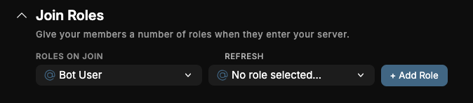
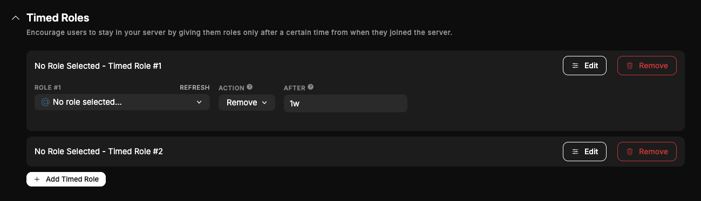
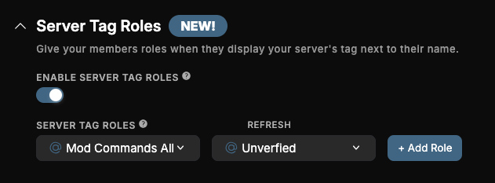
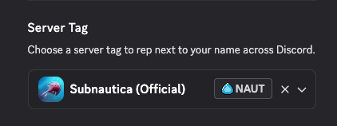
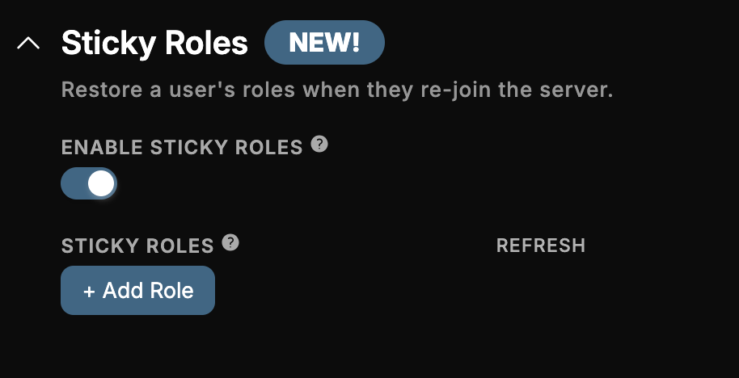

# Auto Role

Automatically assign roles on join, over time, or for server tags.

## Join Roles

Give any number of roles to users that join your server, to have all members with a members role. This can be used in conjunction with the [Verification Module](./verification.md).

## Timed Roles

You can give/remove roles to and from users a while after they joined with Timed Roles. You can add up to 10 timed roles and you can customize the following:

- The role to add/remove
- The action (Remove/Add)
- The after - after how long the role should be added/removed.

This can be used to give users more roles the longer they are in the server!

## Server Tag Roles

You can give users a number of role(s) when they display your server's tag next to their name.

You can choose your tag in the user profile settings:

### Additional Info

- If your server's boosts run out the roles will **not** be removed and it will only be removed once the user clears or changes their tag. This is because your server is still their 'Primary server'.
- You need boost tier 2 to configure a server tag.

## Sticky Roles

When a user re-joins the server and Sticky Roles is enabled, QuaBot will restore their roles to how they were before.

You have two settings to configure for Sticky Roles:

- **Enable Sticky Roles**: if disabled roles are not restored
- **Sticky Roles**: a list of roles to restore upon re-join. If the list is empty, all roles are restored. If roles are defined, only those roles are restored.

## Need Help?

Join our [Discord server](https://discord.quabot.net) for support, bug reports, and setup help.
