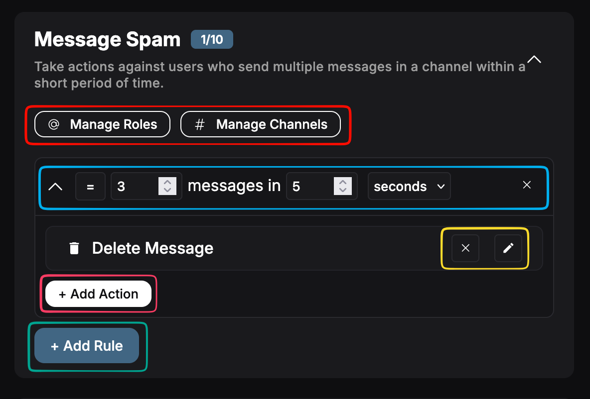
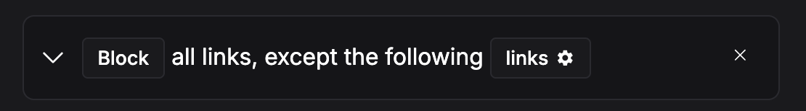
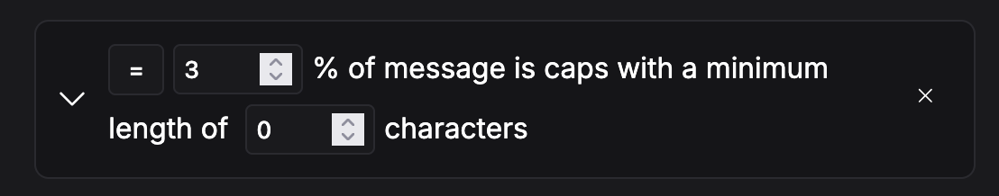
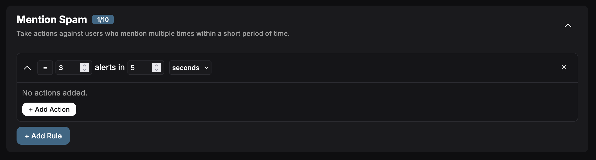

# Auto Moderation

Set up automated moderation rules to maintain order in your server. Auto Moderation allows you to automatically secure your server from spam, profanity and unwanted users. It's split up in 3 categories:

- **Advanced Auto Moderation:** Allows you to customize the rules, limits for different types of Automod like Spam, Mentions and caps.
- **Discord Built-in Auto Moderation:** Allows you to expand on Discord's default Automod with advanced actions to take when the users trigger it.
- **Join Guard:** Take actions on certain users and accounts when they join with customizable actions and filters, such as generated names, account creation date and more.

Let's take a look at all the forms of automod.

## Advanced Auto Moderation

:::info
Automod is quite a complicated module, feel free to ask questions on our [Discord Server!](#need-help). Advanced automod is recommended for servers that want more control over their server. Want an easier setup? Use [Discord Automod!](#discord-built-in-auto-moderation)
:::

Advanced Automod has 11 different types of moderation to check. This includes things like Message Spam, Caps, or Blocked Links. Each of these is configured individually and consists of a few basic principles:

### Configuration Overview

All modules are configured using a similar interface:

- Roles & Channels: configure the excluded or included roles and channels. Can be used to block or whitelist certain channels and roles. If set to 'included' only those roles/channels are accepted, excluded blocks only those roles/channels.
- Rule Configuration: configure the rule, all of these are configured in a similar way: '> 3 messages in 5 seconds', where you can choose between = or >=, change the messages requirement, and the timespan. You can add up to 10 of these rules.
- Action Configuration: delete or edit an action. Used to configure it's settings.
- Add Action: add an action to the rule.
- Add Rule: add a new rule to the automod type.

Each of these buttons is explained in more detail below.

### Rules

The automod is based on rules. You can add a rule by clicking + Add Rule. There you can configure the settings for that rule, such as how many messages should be flagged within the timespan. You have the following options:

- Condition: Equals or greater than, trigger once or always if bigger than a certain count.
- Amount of Triggers: how many triggers are required for the rule to activate.
- Duration/Timespan: during what time do these triggers have to happen.

### Actions

For each of these rules, you can add up to 10 total actions! These actions can do a lot of things to cleanup your server. The following actions are available: (\*not all actions available for all automod types)

| Name            | Description                                                                               |
| --------------- | ----------------------------------------------------------------------------------------- |
| Delete Message  | Delete either the last or all of the triggered messages.                                  |
| Send Message    | Send a message in the channel, as reply or regular message. Can be deleted after sending. |
| Send DM         | Send a message as DM to the user. Can be deleted after sending.                           |
| Add Reactions   | Add a number of reactions to the message.                                                 |
| Add Role        | Add role(s) to the user.                                                                  |
| Remove Role     | Remove role(s) from the user.                                                             |
| Set Roles       | Update all the user's roles to a new set of roles.                                        |
| Report to Staff | Send a message to a staff channel with reason to notify staff.                            |
| Warn User       | Give a (temporary) warning.                                                               |
| Kick User       | Kick user from server.                                                                    |
| Ban User        | (Temp)ban user from server.                                                               |
| Timeout User    | Timeout user on server.                                                                   |

All options can also be delayed up to 5 minutes.

### Channels & Roles

:::note Permissions
Automod will ignore the users with Administrator, Manage server or Manage Messages permissions.
:::

You can configure the roles and channels that are blocked or included for the automod type. You can either:

- Exclude channels/roles. Automod checks all channels/roles except for these.
- Include channels/roles. Automod checks no channels/roles, only these.

This is configured in the popup, and will be saved automatically when closing.

### Links, words & Caps Filters

Some of these rules have an additional setting: word/link groups. These can be configured by clicking on the button within the rule. It will open a popup, where you can add words or links to the filter, as seen below. You can also choose (for some) block or allow all others.

For the caps filter, you can also choose the minimum message length and a caps percentage that will trigger the rule, as seen below.

## Discord Built-In Auto Moderation

Discord Automod allows you to attach actions when a user generates alerts from Discord's automod. It works in a similar way to [Advanced Automod](#advanced-auto-moderation). Let's go over the principles from this form of automod:

:::caution IMPORTANT
In order for these functions to work, you need to enable the Built-In moderation rules. Don't know what we're talking about? Read more [here](https://support.discord.com/hc/en-us/articles/4421269296535-AutoMod-FAQ).
:::

### Rules

The automod is based on rules. You can add a rule by clicking + Add Rule. There you can configure the amount of alerts within the timespan the user needs to trigger the actions. Available options:

- Condition: Equals or greater than, trigger once or always if bigger than a certain count.
- Amount of Alerts: how many alerts are required for the rule to activate.
- Duration/Timespan: during what time do these triggers have to happen.

### Actions

For each of these rules, you can add up to 10 total actions! These actions can do a lot of things to cleanup your server. The following actions are available:

| Name            | Description                                                                               |
| --------------- | ----------------------------------------------------------------------------------------- |
| Send Message    | Send a message in the channel, as reply or regular message. Can be deleted after sending. |
| Send DM         | Send a message as DM to the user. Can be deleted after sending.                           |
| Add Role        | Add role(s) to the user.                                                                  |
| Remove Role     | Remove role(s) from the user.                                                             |
| Set Roles       | Update all the user's roles to a new set of roles.                                        |
| Report to Staff | Send a message to a staff channel with reason to notify staff.                            |
| Warn User       | Give a (temporary) warning.                                                               |
| Kick User       | Kick user from server.                                                                    |
| Ban User        | (Temp)ban user from server.                                                               |
| Timeout User    | Timeout user on server.                                                                   |

All options can also be delayed up to 5 minutes.

## Join Guard

## Need Help?

Join our [Discord server](https://discord.quabot.net) for support, bug reports, and setup help.
