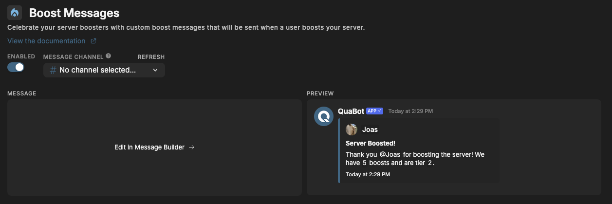

# Boost Messages

Celebrate your server boosters with personalized messages that are automatically sent whenever someone boosts your server.

## How it works

On this page, you can write the message that is sent when a user boosts your server.
The Message Builder shows a live preview so you can instantly see how your message will look in Discord.

You can freely style your message, add emojis, and include dynamic variables. QuaBot will replace these variables with real values when the event happens. For more information about the Message Builder and variables, visit [this page](../embed-builder.md).

## Custom Variables

On top of the regular user and server variables, we support the following additional variables for this module:

- `{tier}` - The server boost tier.
- `{boosts}` - The number of boosts on the server.

## Configuration

Here’s how to set it up:



### Enable Boost Message

Toggle the **Enabled** switch at the top.

### Select a Message Channel

Pick the channel where boost messages will be sent. QuaBot will only send boost messages there.

### Customize Your Message

Click **Edit in Message Builder**  
→ Adjust the text, colors, variables, and formatting as outlined in our [Message Builder Guide](../embed-builder.md).
→ Save your configuration

### Preview

The preview shows what your boost message will look like in Discord.

## Example Output

```
Joas boosted the server!
We’re now at 5 boosts and have reached Tier 2 🎉
Thanks for supporting the community!
```

## Need Help?

Join our [Discord server](https://discord.quabot.net) for support, bug reports, and setup help.
