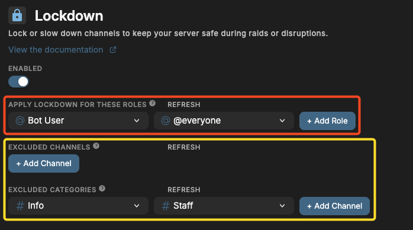
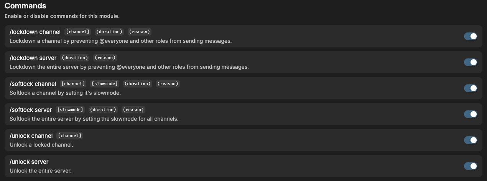

# Lockdown

## Overview

Imagine this; thousands of users joining your server. All of them bots. Spamming the channels, pinging everyone and making chaos. No way you can ban them all manually, you need to stop the spam right now! That's where our Lockdown module comes in. With this module, you can lock the entire server or specific channels. Stopping spam or messages all together. There are two types of lockdown:

**1. Softlock**

Softlock allows you to set a slowmode for either a specific channel, or the entire server at once. Ideal if it's busy but you don't want to stop chatting all together. All the slowmodes are restored once it ends.

**2. Lockdown**

Lockdown locks a channel for the roles you want, or the entire server. You can set a duration (or indefinitely) and the bot will keep the channels read-only. After the lockdown ends, all permissions are restored to the way they were. `/unlock` still unlocks the channel or server and you can provide a **duration** and **reason**.

## How it works

- `/softlock` enables slowmode for the channel or entire server. [Excluded channels and categories](#configuring-the-lockdown-module) will not be slowed down. You can provide a duration (or none). If you provide a **duration** the bot will automatically restore the channel(s) to how they were after the duration. Otherwise you can use `/unlock` to unlock the channel, it will also restore each channel with the correct slowmode they had before it got locked. You can also provide a **reason** that will be sent to the channel for all users to see, to give additional context.
- `/lockdown` is basically the same as `/softlock`, except that it disables messaging entirely. By default, we disable **Send Messages** and **All thread related permissions** for `@everyone` for either all channels or the entered channel. But if you have another role that explicitly has the **Send Messages** enabled for a channel, removing the permission from `@everyone` doesn't work! That's why you can select roles which also have each permission disabled explicitly, preventing anyone from speaking. You can also provide a duration, reason and the [excluded channels and categories](#configuring-the-lockdown-module) will not be locked.
- `/unlock` also takes a channel or server argument and will remove the softlock or lockdown from the selected channel(s). It will restore all permissions and slowmodes to how they were before.

## Configuring the lockdown module

On the dashboard, there are a couple of settings you can tweak.

#### Enabled

Choose wheter you want the lockdown module to be enabled or disabled for your server. This includes softlock, lockdown and unlock.

### Apply lockdown for these roles

Outlined in red, the roles you select here, are the roles whose chat permissions are disabled when the channel (or server) gets locked. By default, we disable **Send Messages** and **All thread related permissions** for `@everyone`. But if you have another role that explicitly has the **Send Messages** enabled for a channel, removing the permission from `@everyone` doesn't work! That's why the roles you select here will also have each permission disabled explicitly, preventing anyone from speaking.

### Excluded channels & categories

Outlined in yellow, these channels and categories cannot be locked and will be ignored when the entire server is (soft)locked.

### Commands

You can enable or disable specific commands at the bottom of the page. If a command is disabled, nobody, including admins, can use it. This module has the following commands that you can toggle on the dashboard:

_Click on the image to enlarge_

## Frequently Asked Questions

### **Does it restore the server to how it was?**

Yes! The bot stores all channel permissions & slowmode from before the lockdown and will restore upon unlock. If it somehow doesn't restore correctly, [please contact us immediately](https://discord.quabot.net) and we will assist you and prevent this from happening in the future.

### **What permissions do you need to use these commands?**

By default, these commands are restricted to the following permissions:

- For lockdown: **Administrator, Manage Channels or Manage Server**
- For softlock & unlock: **Administrator, Manage Channels, Manage Roles or Manage Server**

### **Does the bot lock voice channels?**

Yes!

### **What permissions are restricted?**

The following permissions are **disabled** when a channel is locked (**not softlocked**):

- Send Messages
- Send Messages in Threads
- Create Public Threads
- Create Private Threads
- Add Reactions
- Connect to voice channel

During a lockdown the users **cannot** communicate in a locked channel in any way. The channel is **fully** locked.

For more information, visit the [permissions](../permissions.md) page.

## Need Help?

Join our [Discord server](https://discord.quabot.net) for support, bug reports, and setup help.
