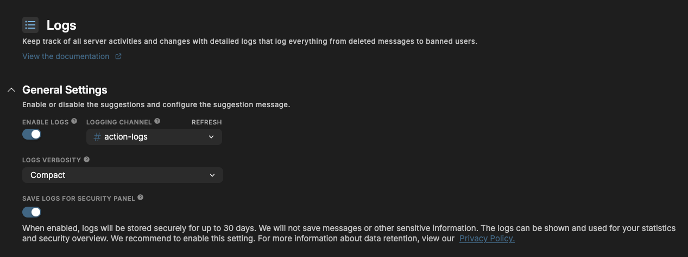
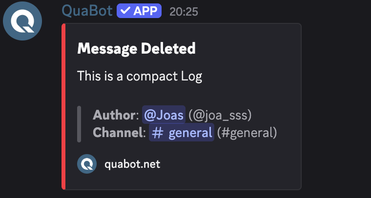
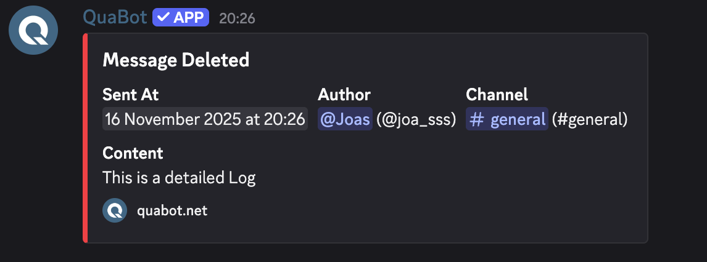
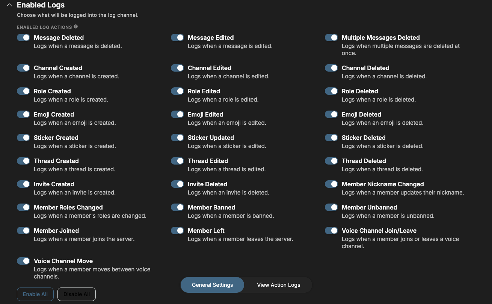
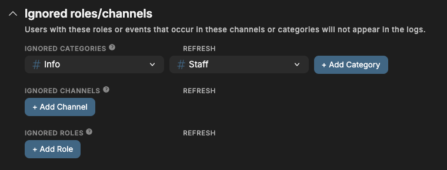
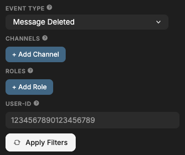

# Logs

Keep track of all server activities and changes with detailed logs that log everything from deleted messages to banned users.

## Overview

Sometimes, users delete a message that you wish you could stil read. It could've been racist or break the rules and the user should be punished for that! Or they edited their message. Or maybe you want to know who was in a voice channel at a certain time. All of that is possible with the QuaBot Logs module, also known as Action Logs.

## How it works

Whenever something happens in your server, QuaBot registers it. You can select what you want to have logged, and everything you have enabled will be sent and logged to a custom channel. Everything from deleted messages to banned users can be sent in your action logs channel. You can even view your action logs on the dashboard. You can choose which channels or roles you want to be excempt from logs. Logs now also have two types: compact and detailed logs to give you exactly the kind of customization you want.

### Events

The following events/actions can be logged:

- **Message Deleted** — Logs when a message is deleted.
- **Message Edited** — Logs when a message is edited.
- **Multiple Messages Deleted** — Logs when multiple messages are deleted at once.
- **Channel Created** — Logs when a channel is created.
- **Channel Edited** — Logs when a channel is edited.
- **Channel Deleted** — Logs when a channel is deleted.
- **Role Created** — Logs when a role is created.
- **Role Edited** — Logs when a role is edited.
- **Role Deleted** — Logs when a role is deleted.
- **Emoji Created** — Logs when an emoji is created.
- **Emoji Edited** — Logs when an emoji is edited.
- **Emoji Deleted** — Logs when an emoji is deleted.
- **Sticker Created** — Logs when a sticker is created.
- **Sticker Updated** — Logs when a sticker is edited.
- **Sticker Deleted** — Logs when a sticker is deleted.
- **Thread Created** — Logs when a thread is created.
- **Thread Edited** — Logs when a thread is edited.
- **Thread Deleted** — Logs when a thread is deleted.
- **Invite Created** — Logs when an invite is created.
- **Invite Deleted** — Logs when an invite is deleted.
- **Member Nickname Changed** — Logs when a member updates their nickname.
- **Member Roles Changed** — Logs when a member's roles are changed.
- **Member Banned** — Logs when a member is banned.
- **Member Unbanned** — Logs when a member is unbanned.
- **Member Joined** — Logs when a member joins the server.
- **Member Left** — Logs when a member leaves the server.
- **Voice Channel Join/Leave** — Logs when a member joins or leaves a voice channel.
- **Voice Channel Move** — Logs when a member moves between voice channels.

## Configuring the logs module

#### Enabled

Choose wheter you want the logs module to be enabled or disabled for your server. No events will be logged or saved when the module is disabled.

#### Logging Channel

The channel for the action log messages. They will be sent in this channel for (staff) members to view.

#### Logs Verbosity

Decide how detailed you want the logs to be. You have two options:

1. **Compact Logs**

   Compact logs just show the basics, only the changed values and little additional information. All the core information is present.

   

2. **Detailed Logs**

   Detailed logs show additional information such as the detailed date, username and more. Gives a better picture but are clutterd and harder to read.

   

#### Save logs for security panel

If enabled, all the logs are stored in the QuaBot Database for up to 30 days in [accordance to our privacy policy](https://quabot.net/policies). They will then be viewable on our dashboard's security panel and used for statistics. We recommend to enable this setting. More information about the [dashboard log viewer can be found below](#dashboard-logs-viewer).

#### Enabled logs

You can select the enabled/disabled events from the list. You can also choose to enable or disable all events at once. Each event also has a description explaining what it is.

#### Ignored roles & channels

You can select roles, channels and categories to be ignored. If a user has an ignored role they will be excluded from the logs and their messages, voice channel joins/leaves etc. will not show up. Channels/Categories that are excluded will not show up in the list (including message deletions and edits that happen in the channel!).

## Dashboard Logs Viewer

At the bottom of the page, you can select the **View Action Logs** tab. This will take you to the Action Logs Viewer on the [Security Panel](../security/security-overview.md).

You will see a full list of the most recent action logs in your server, including users, channels and roles that have been updated. You can filter the list in the top-right.

You can filter by event, role, channel and user id. Don't forget to apply the filters before they will work. You can also search, but the search only searches the loaded action logs. When you reach the bottom you can load more logs with the "Load more" button.

These logs cannot be removed so it is less prone to fraud and deleted logs then the regular channel based system.

## Frequently Asked Questions

### **Why are events not logging?**

The bot might not have the required permissions. You can read all about permissions on the [permissions page](../permissions.md). If the issue persists (and it is not a Message Delete/Edit event) contact us on our [support server](https://discord.quabot.net) and our staff will help you and make sure it won't happen again.

### **Why don't i see old logs in the Dashboard Viewer?**

If you've previously disabled the "Save logs for security panel" setting, the logs are not saved in our database. We cannot load them retroactively.

Old logs are also deleted periodically, so not every log will remain available. The channel's logs will stay forever (unless deleted).

### **Can i delete logs in the Dashboard Viewer?**

No! If you really need a sensetive log removed, contact our [support team](https://discord.quabot.net).

### **Does the Dashboard Viewer save logs in real-time?**

There might be a slight delay, but we expect all logs to be on the dashboard within a (few) minute(s).

### **Why is the username/avatar outdated in the messages or dashboard viewer?**

The logs are a snapshot and the messages' usernames/avatars won't be updated when a user changes their name. The user id is almost always available and it does not change for a user. Use <@USERID> to view the user related to a user id.

### **Will QuaBot log my private messages?**

No. QuaBot cannot access your private messages. It can only access messages in the Discord server for the channels it has access to.

### **Are deleted messages always logged?**

Not all of the time. Most of the time, the message is already stored on the bot, but if the message is really old, it might not be logged correctly. We're still working on a fix for this.

### **Why are bot events not logged?**

Bots make loads of message edits and delete (their) messages all the time. We don't log bot related-events because it would spam the logs and the information is not usefull.

### **Can you access the data or stored action logs?**

All information about data storage and retention can be found on the [privacy policy](https://quabot.net/policies).

### **Do you log attachments for edited/deleted messages?**

If we still have access to them and Discord didn't remove them yet: yes. We do not save them on their own server so after a bit they will become unavailable.

## Need Help?

Join our [Discord server](https://discord.quabot.net) for support, bug reports, and setup help.
