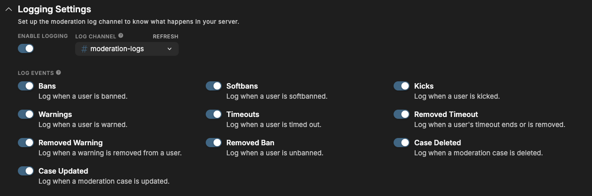
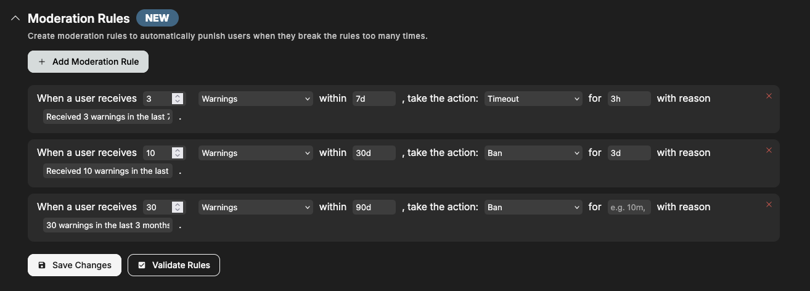
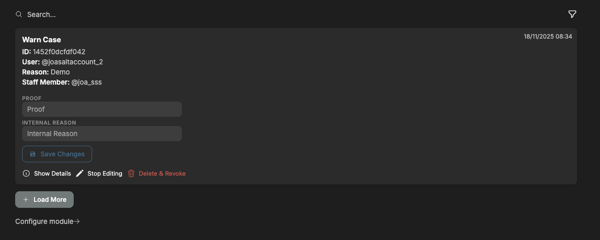
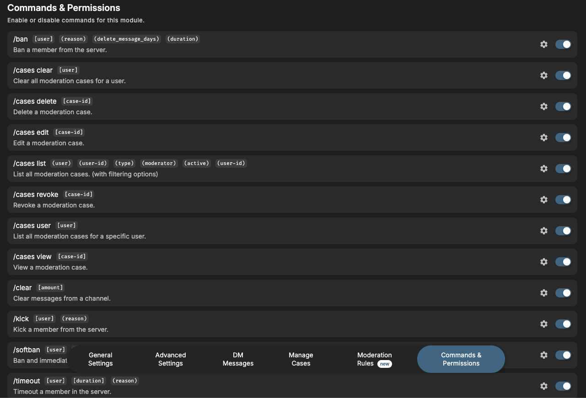

# Moderation

Keep your server safe with bans, kicks, warnings, and timeouts. With detailed logging and highly customizable settings.

## Overview

If you have users in your server who keep breaking the rules, swearing or spamming, you can use the QuaBot Moderation Commands to punish the user. The bot will keep a record of all punishments that a user has received with our [case-based](#cases) system. The following punishments are available:

- Ban, Tempban
- Timeout
- Warning
- Kick
- Softban

In this article we will explore how the moderation module works and how you can configure it

## How it works

### Punishing a user

In order to punish a user, you need to pick an appropriate punishment. We're not here to dictate when to use what punishment so we'll leave that up to you. We'll go over the types of punishments and moderation commands and how they work.

#### Ban

Use `/ban [user] (reason) (duration) (delete message days)` to ban a user.

- The user can (as of now) only be a user in your server.
- **Reason**: choose a reason for banning the user. This will be visible for the user and is optional (unless [required](#configuring) in the settings). You can add an [internal reason](#internal-reason--proof) for any sensitive information you don't want to send to the user.
- **Duration**: ban the user for a custom duration with the format `1d` `30min` etc. After the duration, the user will be unbanned automatically. The duration is **optional** but the ban will be **permanent** if left empty.
- **Delete message days**: automatically delete the last X number of days worth of messages the user has sent.

#### Kick

Use `/kick [user] (reason)` to kick a user from your server.

- The user can (as of now) only be a user in your server.
- **Reason**: choose a reason for kicking the user. This will be visible for the user and is optional (unless [required](#configuring) in the settings). You can add an [internal reason](#internal-reason--proof) for any sensitive information you don't want to send to the user.

#### Kick

Use `/kick [user] (reason)` to kick a user from your server.

- The user can (as of now) only be a user in your server.
- **Reason**: choose a reason for kicking the user. This will be visible for the user and is optional (unless [required](#configuring) in the settings). You can add an [internal reason](#internal-reason--proof) for any sensitive information you don't want to send to the user.

#### Softban

Use `/softban [user] [delete_message_days] (reason)` to softban a user from your server. A softban is a ban that is instantly removed, this can be used to remove the last X number of days worth of messages sent by a user. Basically clearing their messages for the last few days.

- The user can (as of now) only be a user in your server.
- **Delete message days**: automatically delete the last X number of days worth of messages the user has sent.
- **Reason**: choose a reason for softbanning the user. This will be visible for the user and is optional (unless [required](#configuring) in the settings). You can add an [internal reason](#internal-reason--proof) for any sensitive information you don't want to send to the user.

#### Timeout

Use `/timeout [user] [duration] (reason)` to timeout a user on your server. Uses the built-in timeout system to prevent the user from speaking.

- The user can (as of now) only be a user in your server.
- **Duration**: Max 28 days, format: `1d`, `30min` etc. How long to timeout the user.
- **Reason**: choose a reason for timing out the user. This will be visible for the user and is optional (unless [required](#configuring) in the settings). You can add an [internal reason](#internal-reason--proof) for any sensitive information you don't want to send to the user.

#### Warn

Use `/warn [user] (reason) (duration)` to warn a user without punishing them.

- The user can (as of now) only be a user in your server.
- **Reason**: choose a reason for warning the user. This will be visible for the user and is **required**. You can add an [internal reason](#internal-reason--proof) for any sensitive information you don't want to send to the user.
- **Duration**: warn the user for a custom duration with the format `1d` `30min` etc. After the duration, the warning will be marked as inactive. The duration is **optional** and the warning will be **permanent** if left empty.

After you execute the punishment, you might be prompted to confirm it. This can be [configured](#configuring) later on.

### Internal Reason & Proof

After the punishment is confirmed and executed, you will be prompted with 3 options:

- **Add Proof**: You can add text-based proof as to why the user was punished. You can upload a URL to an image or something else. This is **optional**.
- **Add Proof Message**: You can copy the link of a message and paste it in the popup. The bot will then look for the message and save it in the [case](#cases). This is **optional**.
- **Add Internal Reason**: You can add a reason for the punishment that is only visible in the [log channel](#configuring) and to staff members. The user will never see this. This is **optional**.
- **Finish**: Use this to disable the buttons.

After your Proof Message has been added:

If you forgot to add proof or needed time to collect your proof, you can always do this later.

### Cases

Every punishment is saved as a **Moderation Case**. These can always be viewed later, unless deleted. Let's take a look at the commands for moderation cases!

#### /cases list

List all the moderation cases in the server. You can choose filters to apply (user, type of punishment, moderator, user-id (for banned users), punishment active or revoked). You will get a small summary of the punishment. You can easily **View the Details**, **Revoke** or **Edit** the punishment. You can also scroll to the next punishment with the buttons below. You can view the details for every bit of information about the case. **Revoking** the punishment also removes any active punishment. Use the **Edit** button to add proof or internal reasons. A couple of examples below:

> A moderation case viewed from `/cases list`

> A moderation case with details shown.

#### /cases clear and /cases revoke

- Use `/cases clear [user]` to remove all cases for a user.
- Use `/cases revoke [case id]` to remove a specific case. The Case ID can always be found with `/cases list` or on the log message.

#### /cases edit

- Use `/cases edit [case id]` to edit a specific case. You can add proof and the internal reason. The Case ID can always be found with `/cases list` or on the log message.

#### /cases delete

- Use `/cases delete [case id]` to completely delete a case. It cannot be found anymore. The Case ID can always be found with `/cases list` or on the log message.

#### /cases user and /cases view

- Use `/cases user [user]` to get all cases for a specific user. The menu works the same way as [`/cases list`](#cases-list).
- Use `/cases view [case id]` to view a specific case. This shows all the details available for said case.

That's cases explained! Cases can also be managed on the [dashboard](#dashboard-case-manger). More info can be found on that section of the wiki.

### Moderation Rules

QuaBot can now automatically take action against users who hit a certain number of infractions. Every time someone gets punished, the bot checks your custom rules and applies the next step if needed. This can be used to punish a user when they reach a certain number of infractions to automatically keep your server secure.

You decide everything: how many infractions trigger it, what punishment follows, over what timespan, how long it lasts, and what reason shows up.

**Example:**

> When a user gets 3 warnings in the last 7 days, timeout them for 1 day with the reason: “Please read the rules again, you’ve received 3 warnings in 7 days.”

The bot will then count the user’s recent warnings and apply the timeout automatically.

### Permissions

For more information about command permissions visit our [Permissions (Moderation permissions via QuaBot Dashboard)](../permissions.md#2-handle-moderation-permissions-via-quabot-dashboard) page. Moderation permissions have some extra options compared to regular bot commands, so read the article carefully.

## Configuring

You have a LOT of settings that you can configure for moderation. No worries, we'll walk you through all of them.

### General Settings

#### Moderation Logs

- **Enable logging**: log when certain moderation-related events happen. Choose if you want it enabled or not.
- **Log Channel**: the channel that log messages will be sent in.
- **Log Events**: choose what events will be logged. Ranging from bans to case case updates.
  

#### Immune Roles

- These are the roles that cannot be punished. Users only need one of these to be immune. Even administrators and server owners cannot punish users with these roles.
- **Global Immune Roles**: roles that cannot be punished with ANY moderation command.
- **Ban Immune Roles**: roles that cannot be banned, tempbanned or softbanned.
- **Kick Immune Roles**: roles that cannot be kicked.
- **Timeout Immune Roles**: roles that cannot be timed out.
- **Warn Immune Roles**: roles that cannot be warned.

### Advanced Settings

- **Default Reason**: if no reason is provided, this is the reason that is used.
- **Require Reason**: require staff members to provide a reason for a punishment.
- **Require Confirmation**: require staff to confirm their punishment, they will have to review and read through it before confirming.
- **Remove Message**: if a [proof message](#internal-reason--proof) is entered, the message will be deleted and only saved with the case.
- **Require Confirmation when Recent Case**: iff there was a recent case (within +- an hour), require the staff member to confirm the punishment before it's executed. This can be used to prevent users being punished for the same thing twice.

### DM Messages

- **Send Direct Messages**: enable or disable the bot sending DM notifications for punishment updates to users.
- **DM Events**: choose when a user should receive a DM notification. (Punishment Created or Punishment Ended)
- **Ban Message**: customize the message sent to the user when banned.
- **Kick Message**: customize the message sent to the user when kicked.
- **Warn Message**: customize the message sent to the user when warned.
- **Timeout Message**: customize the message sent to the user when timed out.

### Moderation Rules

Create moderation rules. Enter the values and options you want and save your changes. The bot will automatically handle the punishments. You can configure what punishments, how many, during what timespan and more.

## Dashboard Case Manger

- You can view the moderation cases on the dashboard. You can **Edit** them, add proof and internal reasons. You can **Delete & Revoke** them. You can also view additional details to see exactly what happened. You can also view the **Message Proof**.
- On the top right, there is the time that the case was created.
- You can search & filter through the cases at the top. There a lot of options to choose from to refine your search.

You can view the case manager below:

## Commands

You can enable or disable specific commands at the bottom of the page. If a command is disabled, nobody, including admins, can use it. Every moderation command can be disabled. More information about Permissions and configuring the Command Permissions [can be found here](../permissions.md#2-handle-moderation-permissions-via-quabot-dashboard).

_Click on the image to enlarge_

## Frequently Asked Questions

### **Why can't I punish a user?**

- The bot might not have the required permissions to execute punishments. Read more [here](../permissions.md).
- The user might have an [Immune Role](#immune-roles). Users with an immune role cannot be punished.
- You don't have permissions to use a command, the server has changed the required permissions. Read more [here](../permissions.md).
- Still can't figure it out? Join our [Discord server](https://discord.quabot.net) for support, bug reports, and setup help.

### **Why do I have to enter a reason?**

You have probably enabled the **Require Reason** option. You can learn more about this setting [here](#advanced-settings).

### **Why is my proof message being deleted?**

You have enabled the **Delete Proof Message** option. This automatically deletes the proof message when it's entered. You can learn more about this setting [here](#advanced-settings).

### **Where can I find a case ID?**

Using `/cases`. You can list or find a case for a user and the case ID will be listed on the message. You can also use the [dashboard](#dashboard-case-manger). Learn more about cases and case IDs [on the cases section](#cases).

### **Who can see the Internal Reason?**

Only staff members and users that can access the [log channel](#moderation-logs).

### **Why are users not getting DMs?**

- The user has disabled DMs.
- QuaBot doesn't share any server with the user (after a ban) and cannot DM the user.
- You have disabled [DM notifications](#dm-messages).

Still not working? That's wierd! Join our [Discord server](https://discord.quabot.net) and we'll look into it with you!

### **Can I restore a deleted case?**

No, but you can join our [Discord server](https://discord.quabot.net) and we can try to restore it for you.

### **Why has my softban been reverted immediately?**

That's what a softban is! It's meant to clear a users' messages. More info about softbans can be found [here](#softban).

### **Why is a warn reason required?**

Because the warning needs to have a reference. A warning without a reason makes no sense, and we have required it for now. If you want to see this changed, you can join our [Discord server](https://discord.quabot.net) and suggest it.

### **How can I clear the cases for a banned user?**

At this time there is no easy way to clear cases for a banned user or a user that is not in the server. If this is something your server needs, you can join our [Discord server](https://discord.quabot.net) and suggest it. For now it's on our roadmap but not a priority unless a server really needs the feature.

## Need Help?

Join our [Discord server](https://discord.quabot.net) for support, bug reports, and setup help.
