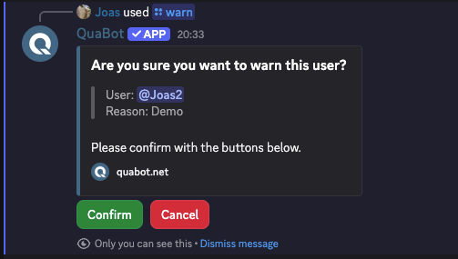
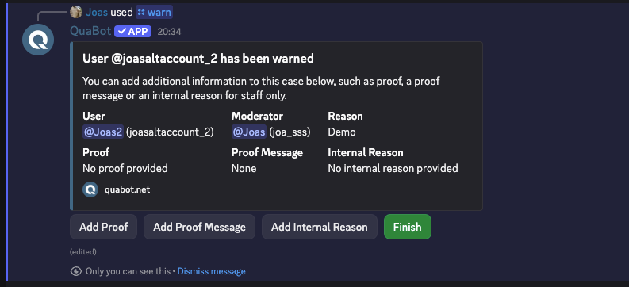
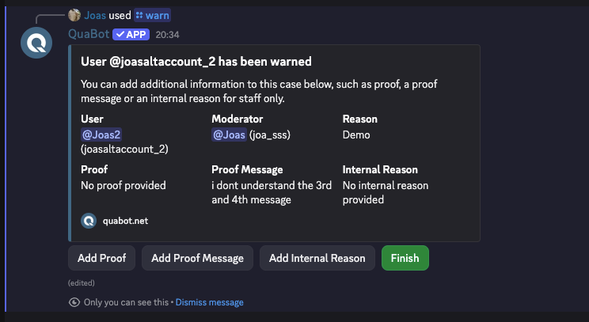
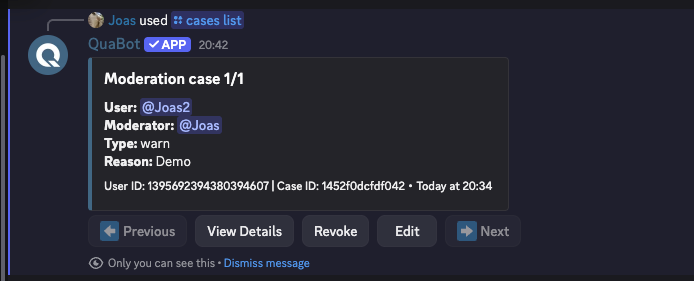
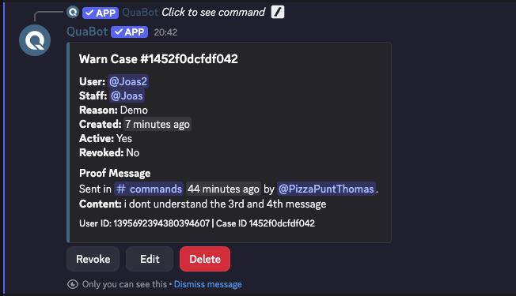

# Moderation

## Overview

If you have users in your server who keep breaking the rules, swearing or spamming, you can use the QuaBot Moderation Commands to punish the user. The bot will keep a record of all punishments that a user has received with our [case-based](#cases) system. The following punishments are available:

- Ban, Tempban
- Timeout
- Warning
- Kick
- Softban

In this article we will explore how the moderation module works and how you can configure it

## How it works

### Punishing a user

In order to punish a user, you need to pick an appropriate punishment. We're not here to dictate when to use what punishment so we'll leave that up to you. We'll go over the types of punishments and moderation commands and how they work.

#### Ban

Use `/ban [user] (reason) (duration) (delete message days)` to ban a user.

- The user can (as of now) only be a user in your server.
- **Reason**: choose a reason for banning the user. This will be visible for the user and is optional (unless [required](#configuring) in the settings). You can add an [internal reason](#internal-reason--proof) for any sensitive information you don't want to send to the user.
- **Duration**: ban the user for a custom duration with the format `1d` `30min` etc. After the duration, the user will be unbanned automatically. The duration is **optional** but the ban will be **permanent** if left empty.
- **Delete message days**: automatically delete the last X number of days worth of messages the user has sent.

#### Kick

Use `/kick [user] (reason)` to kick a user from your server.

- The user can (as of now) only be a user in your server.
- **Reason**: choose a reason for kicking the user. This will be visible for the user and is optional (unless [required](#configuring) in the settings). You can add an [internal reason](#internal-reason--proof) for any sensitive information you don't want to send to the user.

#### Kick

Use `/kick [user] (reason)` to kick a user from your server.

- The user can (as of now) only be a user in your server.
- **Reason**: choose a reason for kicking the user. This will be visible for the user and is optional (unless [required](#configuring) in the settings). You can add an [internal reason](#internal-reason--proof) for any sensitive information you don't want to send to the user.

#### Softban

Use `/softban [user] [delete_message_days] (reason)` to softban a user from your server. A softban is a ban that is instantly removed, this can be used to remove the last X number of days worth of messages sent by a user. Basically clearing their messages for the last few days.

- The user can (as of now) only be a user in your server.
- **Delete message days**: automatically delete the last X number of days worth of messages the user has sent.
- **Reason**: choose a reason for softbanning the user. This will be visible for the user and is optional (unless [required](#configuring) in the settings). You can add an [internal reason](#internal-reason--proof) for any sensitive information you don't want to send to the user.

#### Timeout

Use `/timeout [user] [duration] (reason)` to timeout a user on your server. Uses the built-in timeout system to prevent the user from speaking.

- The user can (as of now) only be a user in your server.
- **Duration**: Max 28 days, format: `1d`, `30min` etc. How long to timeout the user.
- **Reason**: choose a reason for timing out the user. This will be visible for the user and is optional (unless [required](#configuring) in the settings). You can add an [internal reason](#internal-reason--proof) for any sensitive information you don't want to send to the user.

#### Warn

Use `/warn [user] (reason) (duration)` to warn a user without punishing them.

- The user can (as of now) only be a user in your server.
- **Reason**: choose a reason for warning the user. This will be visible for the user and is **required**. You can add an [internal reason](#internal-reason--proof) for any sensitive information you don't want to send to the user.
- **Duration**: warn the user for a custom duration with the format `1d` `30min` etc. After the duration, the warning will be marked as inactive. The duration is **optional** and the warning will be **permanent** if left empty.

After you execute the punishment, you might be prompted to confirm it. This can be [configured](#configuring) later on.

### Internal Reason & Proof

After the punishment is confirmed and executed, you will be prompted with 3 options:

- **Add Proof**: You can add text-based proof as to why the user was punished. You can upload a URL to an image or something else. This is **optional**.
- **Add Proof Message**: You can copy the link of a message and paste it in the popup. The bot will then look for the message and save it in the [case](#cases). This is **optional**.
- **Add Internal Reason**: You can add a reason for the punishment that is only visible in the [log channel](#configuring) and to staff members. The user will never see this. This is **optional**.
- **Finish**: Use this to disable the buttons.

After your Proof Message has been added:

If you forgot to add proof or needed time to collect your proof, you can always do this later.

### Cases

Every punishment is saved as a **Moderation Case**. These can always be viewed later, unless deleted. Let's take a look at the commands for moderation cases!

#### /cases list

List all the moderation cases in the server. You can choose filters to apply (user, type of punishment, moderator, user-id (for banned users), punishment active or revoked). You will get a small summary of the punishment. You can easily **View the Details**, **Revoke** or **Edit** the punishment. You can also scroll to the next punishment with the buttons below. You can view the details for every bit of information about the case. **Revoking** the punishment also removes any active punishment. Use the **Edit** button to add proof or internal reasons. A couple of examples below:

> A moderation case viewed from `/cases list`

> A moderation case with details shown.

#### /cases clear and /cases revoke

#### /cases edit

#### /cases delete

#### /cases user and /cases view

That's cases explained! Cases can also be managed on the [dashboard](#dashboard-case-manger). More info can be found on that section of the wiki.

### Moderation Rules

### Permissions

For more information about command permissions visit our [Permissions (Moderation permissions via QuaBot Dashboard)](../permissions.md#2-handle-moderation-permissions-via-quabot-dashboard) page. Moderation permissions have some extra options compared to regular bot commands, so read the article carefully.

## Configuring

## Dashboard Case Manger

## Commands

## Frequently Asked Questions

## Need Help?

Join our [Discord server](https://discord.quabot.net) for support, bug reports, and setup help.
