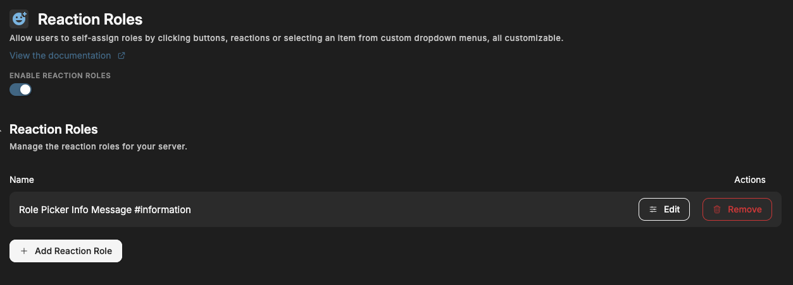
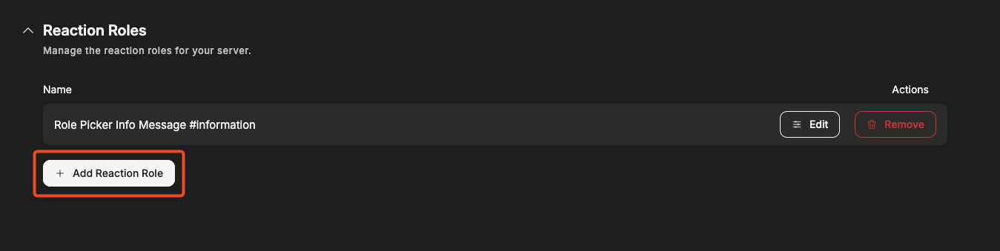
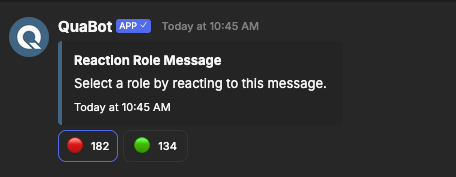
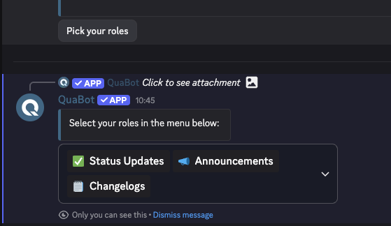
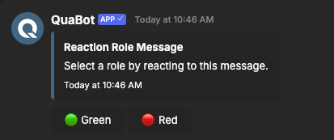
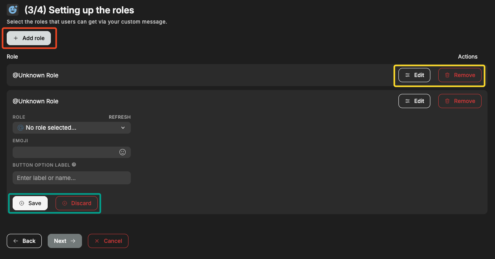
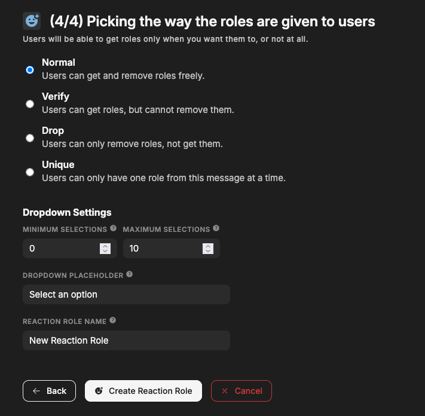
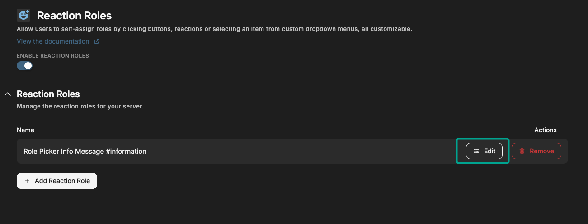

# Reaction Roles

Allow users to self-assign roles by clicking buttons, reactions or selecting an item from custom dropdown menus, all customizable.

## Overview

Reaction Roles can be used to give users a choice; what roles do they want in your server? Using QuaBot you can send a message to any channel with either:

- **Reactions**: user get/remove roles by clicking on the corresponding emoji.
- **Buttons**: users click on a button to get/remove a role.
- **Dropdown**: users choose their roles from a list using a dropdown. The roles they have are pre-selected.

There are multiple 'modes' when it comes to granting roles, more about that later on.

## Configuring the module

You can enable the module in general at the top. Below that is the section with reactionroles. You can edit or create reactionroles by clicking on the respective buttons. More info about creating and editing reaction roles is found below.

### Create reaction role

Click on the "Add Reaction Role" button on the reaction roles module to create a new module.

You will then go through a multi step process. Each step is explained carefully but we'll go over each of them below.

#### Step 1: Picking the way users receive roles

Choose the way users get their roles. You need to choose one of the following ways to get roles. This is the thing that is below the message that users can interact with. Examples:

**Reaction**

Users click on the reaction to add/remove roles.

**Dropdown**

Users click on a button, that will send another message with the user's specific dropdown. That dropdown is used to choose roles. You can customize the text when no role is selected, the minimum or maximum roles a user can pick and more. Other users cannot see this dropdown.

**Button**

Almost the same as reactions, except users click a button and cannot see who chose what role.

#### Step 2: Creating the message

Here you can configure the message, and the channel that the message will be saved in. More information about the message sender can be found [on the Message Builder guide](../embed-builder.md). This message can be edited later on.

#### Step 3: Setting up the roles

You can add a new reaction/option/button, also known as role for users to get by clicking **"Add Role""** outlined in red. It then be added to the list. Remove the option with the **"Delete"** button and edit it with **"Edit"** (both outlined in yellow). When editing, a dropdown opens: choose the role and emoji for that role in that dropdown. **Save or discard your changes with the Save button outlined in green. Without saving the options are not added.**

- If you have a button: also configure the button option label, basically the text next to the button.
- If you have a select menu: also configure the select option label & description. These are shown in the dropdown.

When you're happy and all the roles have been added, click next. You need to add **at least 1 role**.

### Maximum amount of roles

- Reactions: up to 10.
- Buttons: up to 5.
- Dropdown: up to 15.

#### Step 4: Picking the way the roles are given to users

Next up: choose the reaction role mode. This is basically what happens when a user clicks on the button or selects it in the dropdown.

The following options are available:

- **Normal**:
  users can get and remove roles freely. (Works for button, dropdown & reaction)
- **Verify**:
  users can get roles, but cannot remove them. (Works for button, dropdown & reaction)
- **Drop**:
  users can only remove roles, not get them. (Works for button, dropdown & reaction)
- **Unique**:
  users can only have one role from this message at a time. (Works for button, dropdown & reaction)
- **Reversed**:
  users will remove the role when they react, and get it when they remove their reaction. (Works for reaction only)

At the bottom of this page, you **need** to pick a Reaction Role name. This is used to identify it to edit it in the future.

Click on "Create Reaction Role" to send the message and the reaction role will be active immediately!

#### If you use a dropdown:

You need to configure the dropdown settings here.

- Dropdown minimum selections: the min amount of options a user needs to select before the roles are granted.
- Dropdown maximum selections: the max amount of options a user can select.
- Dropdown placeholder: the message that is shown on the dropdown when no roles are selected.

### Edit reaction role

Select the role you want to edit by clicking the **"Edit"** button as shown below:

Editing a reaction role is basically the same as creation, except all the options are listed below each other. If you don't understand a setting, please refer to the section [above](#create-reaction-role).

## Frequently Asked Questions

### **Why are users not getting the roles?**

Make sure the QuaBot role is above their top role and the role it needs to give. The bot also needs 'Manage Roles' to give roles. More info about permissions can be found on the [Permissions](../permissions.md#quabot-role-position) page.

### **Can I use an existing message and create a reaction role for it?**

Not at this time but we are going to add this in the future.

### **I deleted the reaction role message, what now?**

You need to [create a new reaction role](#create-reaction-role). There is currently no option to resend the message.

### **Why does the dropdown option give a button instead of dropdown?**

We generate a new dropdown for each user. We need to select the roles they have already and this can only be done if the user clicks a button to get a new dropdown that's exclusively for them. You will never see another user's dropdown.

### **Can I use custom emojis?**

Not at this time.

### **How many roles can I add?**

- Reactions: up to 10.
- Buttons: up to 5.
- Dropdown: up to 15.

### **Why can't I go to the next step when creating a reaction role?**

You need to make sure that your entered settings are valid. Make sure that:

- Step 1: You select a type of reaction role.
- Step 2: Make sure you select a channel to send the message to.
- Step 3: Each role has both an emoji, valid role (and if applicable a label or description). All fields need to be filled out, and saved.
- Step 4: You select a mode and enter a reaction role name.

If it still doesn't work join our [Discord server](https://discord.quabot.net) and we'll be happy to help!

## Need Help?

Join our [Discord server](https://discord.quabot.net) for support, bug reports, and setup help.
