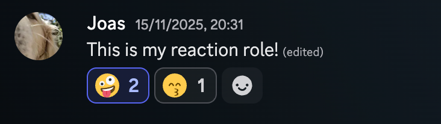
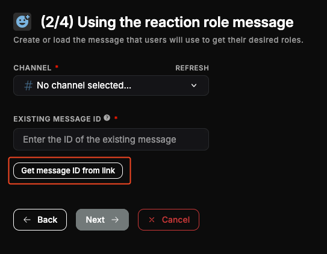
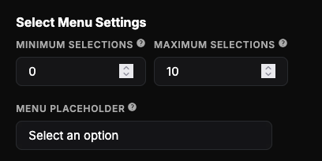
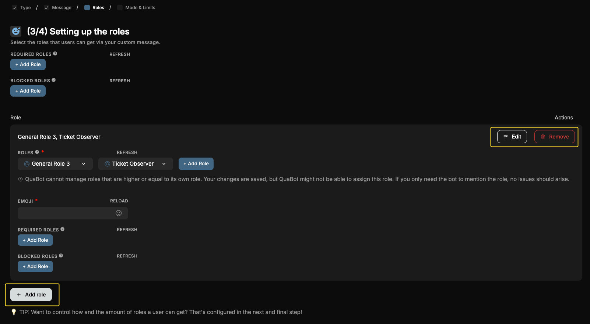

# Reaction Roles

Allow users to self-assign roles by clicking buttons, reactions or selecting an item from custom dropdown menus, all customizable.

:::tip Update
Reaction roles have been updated. We added support for custom emojis, existing messages, multiple roles at once, temporary roles and a lot more! Be sure to check this guide and see if your server wants to use any of these new features. The full changelog can be found [here](/blog/v8-0-2-7).
:::

## Overview

Reaction Roles can be used to give users a choice; what roles do they want in your server? Using QuaBot you can send a message to any channel with either:

- **Reactions**: user get/remove roles by clicking on the corresponding emoji.
- **Buttons**: users click on a button to get/remove a role.
- **Dropdown**: users choose their roles from a list using a dropdown. The roles they have are pre-selected.

There are multiple 'modes' when it comes to granting roles, more about that later on.

## Configuring the module

The page shows a list of reaction roles that your server has created. You can edit or create reaction roles by clicking on the respective buttons. More info about creating and editing reaction roles is found below.

### Create reaction role

Click on the "Add Reaction Role" button on the reaction roles module to create a new module.

You will then go through a multi step process. Each step is explained carefully but we'll go over each of them below.

#### Step 1: Picking the way users receive roles

Choose the way users get their roles. You need to choose one of the following ways to get roles. This is the thing that is below the message that users can interact with. Examples:

**Reaction**

Users click on the reaction to add/remove roles.

**Select Menu**

Users click on a button, that will send another message with the user's specific select menu. That select mnu is used to choose roles. You can customize the text when no role is selected, the minimum or maximum roles a user can pick and more. Other users cannot see this dropdown.

**Button**

Almost the same as reactions, except users click a button and cannot see who chose what role.

**Reaction on existing message**

Users click on the reaction to add/remove roles. You can use an existing message, sent by another user for this one instead of sending a new one.

#### Step 2: Creating the message

**If you chose Reaction, Button or Select Menu Mode:**

Here you can configure the message, and the channel that the message will be saved in. More information about the message sender can be found [on the Message Builder guide](../embed-builder.md). This message can be edited later on.

**If you used the existing message option:**

_For power users:_

You can select a channel and paste the message ID of the message you want to use. QuaBot will locate and check the message when you finish the creation process.

_For regular users:_

Simply click the 'Get Message ID from link' button, and paste in the message URL. This will automatically grab the ID etc. without complex configuration. You can copy the message URL by right-clicking the message, going to Copy and clicking 'Copy Message Link'

#### If you use a dropdown:

You need to configure the dropdown settings here.

- Dropdown minimum selections: the min amount of options a user needs to select before the roles are granted.
- Dropdown maximum selections: the max amount of options a user can select.
- Dropdown placeholder: the message that is shown on the dropdown when no roles are selected.

#### Step 3: Setting up the roles

You can add a new reaction/option/button, also known as role for users to get by clicking **"Add Role""** outlined in red. It then be added to the list. Remove the option with the **"Delete"** button and edit it with **"Edit"** (both outlined in yellow).

When editing, the dropdown opens: choose the role(s) and emoji for that role in that dropdown. You can give **multiple roles** and use **custom emojis**.

- If you have a button: also configure the button option label, basically the text next to the button.
- If you have a select menu: also configure the select option label & description. These are shown in the dropdown.
- For buttons & select menus: you can also toggle the emoji. This will hide it in the button or select menu.

Additional settings are [Blocked & Required Roles](#requiredblocked-roles), read more about those below.

When you're happy and all the roles have been added, click next. You need to add **at least 1 role**.

#### Maximum amount of roles

- Reactions: up to 10 and 20 for premium servers.
- Buttons: up to 5 and 25 for premium servers.
- Dropdown: up to 15 and 25 for premium servers.

#### Required/Blocked Roles

This is on the global level or the per-option level. Global applies to all options and is configured at the top of the 'Roles section', the per-option only apply for that specific role/option.

- You can also set a list of roles the user NEEDS to use the reaction role.
- The blocked roles, if the user has any of them, prevents the user from using the reaction role.

#### Step 4: Picking the way the roles are given to users

Next up: choose the reaction role mode. This is basically what happens when a user clicks on the button or selects it in the dropdown.

The following options are available:

- **Normal**:
  users can get and remove roles freely. (Works for button, dropdown & reaction)
- **Add only**:
  users can get roles, but cannot remove them. (Works for button, dropdown & reaction)
- **Remove only**:
  users can only remove roles, not get them. (Works for button, dropdown & reaction)
- **Reversed**:
  users will remove the role when they react, and get it when they remove their reaction. (Works for reaction only)

#### Role Limits

This is the maximum amount of roles the user can get from the reaction role. It checks what role(s) the user has, use this as an alternative to the 'Unique mode' that was previously available. This limit cannot be higher then the amount of roles.

#### Temporary Roles (PREMIUM)

Temporary roles are the reaction roles that will be removed after they have been given. Enable them and setup a temporary duration. After this duration the roles are automaticall removed! This feature is only for [QuaBot Premium Servers.](../premium.md)

At the bottom of this page, you **need** to pick a Reaction Role name. This is used to identify it to edit it in the future.

Click on "Create Reaction Role" to send the message and the reaction role will be active immediately!

### Edit reaction role

Select the role you want to edit by clicking the **"Edit"** button as shown below:

Editing a reaction role is basically the same as creation, except all the options are listed below each other. If you don't understand a setting, please refer to the section [above](#create-reaction-role).

## Frequently Asked Questions

### **Why are users not getting the roles?**

Make sure the QuaBot role is above their top role and the role it needs to give. The bot also needs 'Manage Roles' to give roles. More info about permissions can be found on the [Permissions](../permissions.md#quabot-role-position) page.

### **Can I use an existing message and create a reaction role for it?**

Not at this time but we are going to add this in the future.

### **I deleted the reaction role message, what now?**

You need to [create a new reaction role](#create-reaction-role). There is currently no option to resend the message.

### **Why does the select menu option give a button instead of select menu?**

We generate a new select menu for each user. We need to select the roles they have already and this can only be done if the user clicks a button to get a new select menu that's exclusively for them. You will never see another user's select menu.

### **Can I use custom emojis?**

Yes!

### **How many roles can I add?**

- Reactions: up to 10 and 20 for premium.
- Buttons: up to 5 and 25 for premium.
- Dropdown: up to 15 and 25 premium.

### **Why can't I go to the next step when creating a reaction role?**

You need to make sure that your entered settings are valid. Make sure that:

- Step 1: You select a type of reaction role.
- Step 2: Make sure you select a channel to send the message to.
- Step 3: Each role has both an emoji, valid role (and if applicable a label or description). All fields need to be filled out, and saved.
- Step 4: You select a mode and enter a reaction role name and configure the limits.

### **Does the bot send DMs for this module?**

Yes! When a temporary role is removed and for reaction-based reaction roles.

If it still doesn't work join our [Discord server](https://discord.quabot.net) and we'll be happy to help!

### **Why does nothing happen when I click a reaction or button?**

This usually means the action was blocked for one of the following reasons:

- You are missing a required role.
- You have a blocked role.
- The bot does not have permission to manage the role.
- The role is higher than the QuaBot role.

If the issue is related to your own permissions, QuaBot may send you a DM explaining why the action was denied.
Server configuration issues will appear on the **Issues & Errors** page in the dashboard. For more information, visit the [Permissions page](../permissions.md).

### **What is the difference between global and per-option required roles?**

- **Global required roles** apply to **all options** within a reaction role.
- **Per-option required roles** only apply to **one specific option**.

Use global required roles when access should be restricted for the entire message.
Use per-option required roles for more fine-grained control over individual role options.

### **What happens if a user clicks the same temporary role twice?**

Temporary roles are **cancelable**:

- First click: the role is given temporarily.
- Second click (before expiration): the role is removed immediately and the timer is cancelled.

This allows users to opt out without waiting for the temporary duration to expire.

### **What happens if the bot restarts while a temporary role is active?**

Nothing breaks.
QuaBot stores temporary role data in the database and processes expirations automatically.
Even after restarts, temporary roles will still be removed once their duration expires.

### **Why are temporary roles a Premium feature?**

Temporary roles require additional background processing, tracking and error handling.
To ensure reliability and performance, this feature is included as part of **QuaBot Premium**.

### **I deleted a role that is used in a reaction role. What happens?**

The deleted role will simply no longer be given to users.
No errors will be shown to users.

You can edit the reaction role to remove or replace the deleted role if needed.

### **Can I move a reaction role message to another channel?**

No. Reaction roles are tied to a specific message and channel.
If you want the reaction role in another channel, you need to create a new one there.

## Need Help?

Join our [Discord server](https://discord.quabot.net) for support, bug reports, and setup help.
