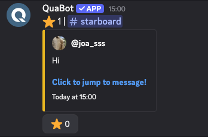
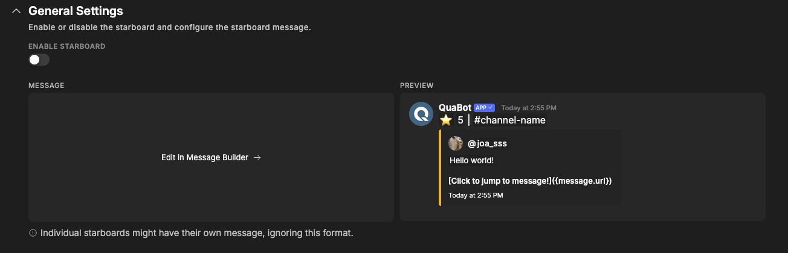
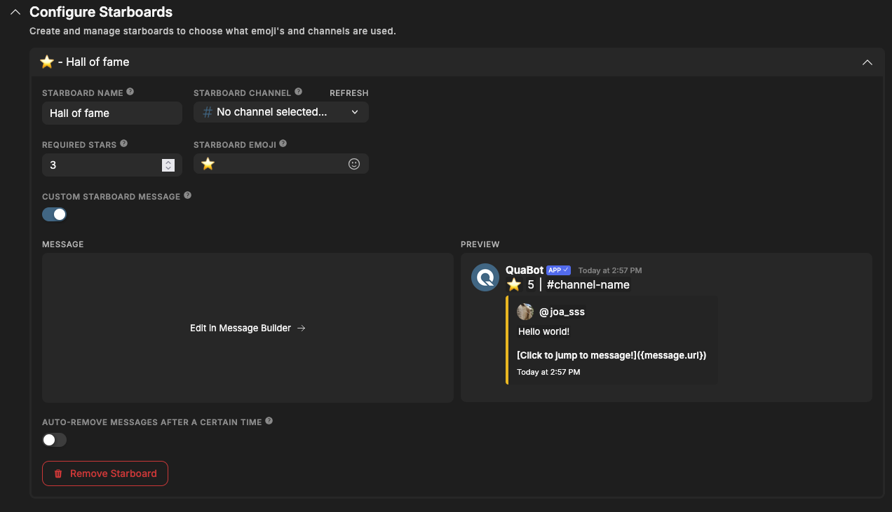

# Starboard

Boost engagement by showcasing popular messages in a dedicated channel once they reach a set number of reactions.

The Starboard highlights messages that your community loves. When a message hits the required number of stars (or any emoji you choose), the bot reposts it in a special starboard channel with all relevant info — who posted it, how many stars it has, and a jump link. Once the message has been sent, a button is available and users can add aditional stars on the starboard message itself.

## Overview

The starboard is a fun way to highlight great messages, memes, announcements or anything that your community enjoys. You decide:

- **Which emoji** counts as a “star”
- **How many reactions** are required
- **Where the starred messages are posted**
- **Optional: custom messages for each starboard**

You can also create **multiple starboards**, each with their own channels, emoji, and required star count.

## How it Works

When someone reacts using the configured emoji:

1. QuaBot checks the message and reaction.
2. If the reaction count reaches the required amount:
   - A starboard post is created in the target channel.
3. The starboard post has a button that users can add virtual stars with.

If the count later drops below threshold, the starboard post is **not** removed automatically. This is being added in a future update.
Example message:

## General Settings

#### Enabled

Enable or disable the starboard module for your server.  
If disabled, no messages will be tracked or posted.

#### Starboard Message Format

This is the default message QuaBot sends when a message hits the required number of stars. You can customize the entire message using the [Message Builder](../embed-builder.md). Once the message has been sent, a button is available and users can add aditional stars on the starboard message itself.

**Note:**  
Individual starboards can override this format with a custom message.

## Starboards

You can create and manage multiple starboards.  
This allows setups like:

- `#starboard` for general chat
- High‑end “highlight” starboards with stricter thresholds

Each starboard has its own configuration.

### Creating a Starboard

Click the **Add Starboard** button to make a new one. You then click on the name of the new starboard, and a dropdown will open. You can configure it in there.

You can configure:

- #### **Starboard Name**

  A name used on the dashboard to identify the starboard.

- #### **Starboard Channel**

  The channel where starred messages will be sent.

- #### **Required Stars**

  How many reactions a message needs before being posted.

- #### **Starboard Emoji**
  Which emoji counts. Only regular emojis are supported at this time.
- #### **Custom Starboard Message**

  Override the general message format for this specific starboard.

- #### **Auto-Remove**

  Automatically delete the starboard entry after a chosen duration (e.g. `1h`, `1d`, `7d`).

  

### Deleting & Editing a Starboard

In order to edit or delete a starboard, click on the starboard's name. The dropdown will open revealing the settings & configuration. You can edit the settings here, the same was as you [created a starboard](#creating-a-starboard) At the bottom, there is a 'Delete Starboard' button to delete the starboard. Make sure to save your changes after you edit or delete a starboard.

## Ignored Channels & Roles

Some channels or groups should not count toward the starboard — for example bots, users that haven't been in your server very long, etc.

You can select:

- **Ignored Roles**
- **Ignored Channels**

Messages from these roles or channels **will not** be added to the starboard. They can still react to _others_.

## Frequently Asked Questions

### **Why isn’t my message appearing on the starboard?**

Possible causes:

- Not enough reactions yet.
- Wrong emoji (must match the starboard’s emoji).
- Message is from an ignored channel or user.
- Starboard module is disabled.
- The bot lacks permissions in the starboard channel. More info about permissions can be found on the [Permissions Page](../permissions.md).

### **Can I have multiple starboards?**

Yes — each with its own settings.

### **Can I use custom emojis?**

Yes.

### **Can I use starboard only for media?**

No not at this time. We are adding this in a future update.

### **Can I star my own messages?**

Yes.

### **Why are starboard posts duplicated?**

You probably have two starboards with the same emoji and channel.  
Disable or edit the duplicates.

### **Can I edit a starboard post after it’s published?**

No, but you can:

- Update the starboard format for future posts
- Delete the message manually

### **Does the starboard repost attachments?**

Not at this time. We are adding this in the future.

### **Does the starboard support custom emojis?**

Not at this time. We are adding this in the future.

## Need Help?

Join our [Discord server](https://discord.quabot.net) for support, bug reports, and setup help.
