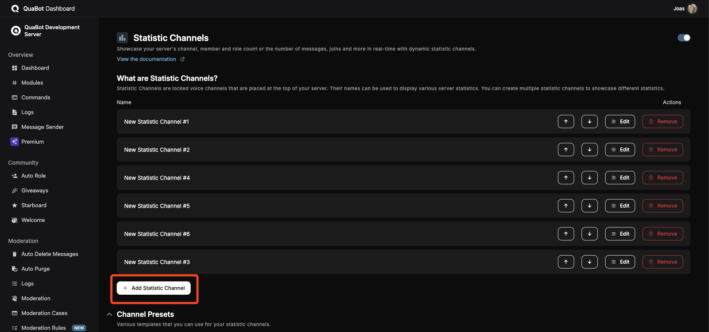
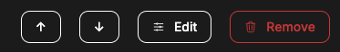
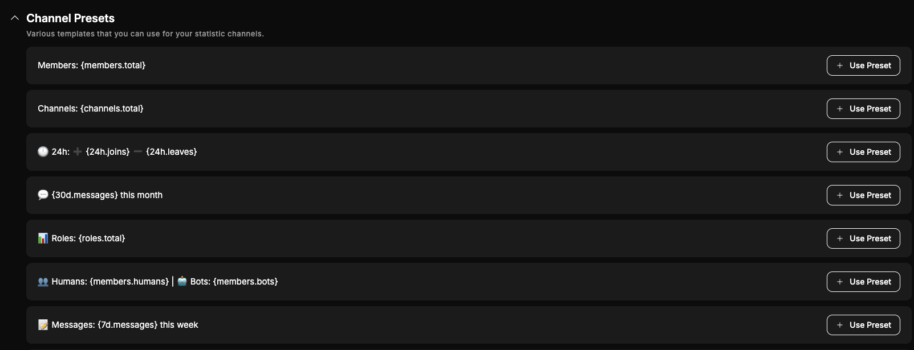

# Statistic Channels

Showcase your server's channel, member and role count or the number of messages, joins and more in real-time with dynamic statistic channels.

This module allows you to proudly display the statistics for your server, right at the top of your channel list! These channels are refreshed regularly giving up-to-date server statistics. The channels are locked voice channels. We'll go over everthing in detail.

## Overview

The module is really straight-forward and easy to configure. You can create up to **5** channels without premium and up to **15** with premium. Each channel has a customizable name that can display a lot of different server statistics, such as the amount of messages in the last month, or the member count. Let's configure a channel!

## Configuring

### Creating a channel

Click on the "Add Statistic Channel" to create an a statstic channel.

A new channel will be added to the list, click "Edit" to edit the channel. This will slide open and reveal all the settings:

- **Enabled**: If not enabled, the channel will not be updated.
- **Name**: This is used to identify the channel on the Dashboard.
- **Update Interval**: How often the channel name should be refreshed/updated. (10/20 minutes only for premium servers). Set this to a lower value to get even more up-to-date statistics.
- **Channel Name**: This is the name that will be given to the voice channel. This supports a lot of variables to display statistics.

Make sure to save after you create the channel!

#### Variables

The following variables can be inserted into the channel name to display accurate information:

**Server**

- `{server.name}` - The server's name

**Channel**

- `{channels.total}` - Total number of channels
- `{channels.text}` - Total number of text channels
- `{channels.voice}` - Total number of voice channels
- `{channels.thread}` - Total number of thread channels
- `{channels.category}` - Total number of category channels

**Roles**

- `{roles.total}` - Total number of channels
- `{roles.hoisted}` - Total number of hoisted roles
- `{roles.mentionable}` - Total number of mentionable roles

**Members**

- `{members.total}` - Total number of members
- `{members.humans}` - Total number of human members
- `{members.bots}` - Total number of bot members

**Statistics**

_24 hours_

- `{24h.messages}` - Amount of messages sent in the last 24 hours
- `{24h.deleted}` - Amount of messages deleted in the last 24 hours
- `{24h.edited}` - Amount of messages edited in the last 24 hours
- `{24h.joins}` - Amount of members that joined in the last 24 hours
- `{24h.leaves}` - Amount of members that left in the last 24 hours
- `{24h.banned}` - Amount of members that were banned in the last 24 hours
- `{24h.links}` - Amount of messages that included links sent in the last 24 hours
- `{24h.mentions}` - Amount of mentions sent in the last 24 hours

_7 days_

- `{7d.messages}` - Amount of messages sent in the last 7 days
- `{7d.deleted}` - Amount of messages deleted in the last 7 days
- `{7d.edited}` - Amount of messages edited in the last 7 days
- `{7d.joins}` - Amount of members that joined in the last 7 days
- `{7d.leaves}` - Amount of members that left in the last 7 days
- `{7d.banned}` - Amount of members that were banned in the last 7 days
- `{7d.links}` - Amount of messages that included links sent in the last 7 days
- `{7d.mentions}` - Amount of mentions sent in the last 7 days

_30 Days_

- `{30d.messages}` - Amount of messages sent in the last 30 days
- `{30d.deleted}` - Amount of messages deleted in the last 30 days
- `{30d.edited}` - Amount of messages edited in the last 30 days
- `{30d.joins}` - Amount of members that joined in the last 30 days
- `{30d.leaves}` - Amount of members that left in the last 30 days
- `{30d.banned}` - Amount of members that were banned in the last 30 days
- `{30d.links}` - Amount of messages that included links sent in the last 30 days
- `{30d.mentions}` - Amount of mentions sent in the last 30 days

### Ordering & Deleting channels

You can change the order of these channels with the Up and Down arrows. You can delete a channel with the Delete button. These changes are reflected in Discord as well.

### Editing

In order to edit an existing channel, simply click "Edit" and change the settings you want. At the next update, the channel name will follow the new format.

Make sure to save your changes!

## Presets

A couple of presets or formats are available below the statistics channels. These are simply to give inspiration and can be added with the "Use Preset" button.

## Frequently Asked Questions

**Do statistic channels apply automatically after enabling the module?**  
They are automatically created when you add them, but they only update every X minutes based on your Update Interval. It doesn't update before this interval. (If you re-enable them it should update within a few minutes)

**Why don’t I see any statistic channels after enabling the module?**  
Enabling the module alone does nothing. You need to add at least one statistic channel and save it before anything appears in Discord.

**How often are statistic channels updated?**  
Statistic channels are refreshed based on the update interval you select. Shorter intervals give more up-to-date data. Some intervals are premium-only.

**What type of channel is used for statistic channels?**  
Statistic channels are voice channels. They are locked and placed at the top of the list.

**Can I use multiple variables in one channel name?**  
Yes. You can combine multiple variables in a single channel name to display several statistics at once.

**Why is my statistic channel not updating?**  
Make sure the channel is enabled, saved, and that QuaBot has permission to manage channels in your server.

**Are statistic channels affected by Discord outages or rate limits?**  
Yes. Updates may be delayed during Discord outages or when Discord rate limits are hit.
