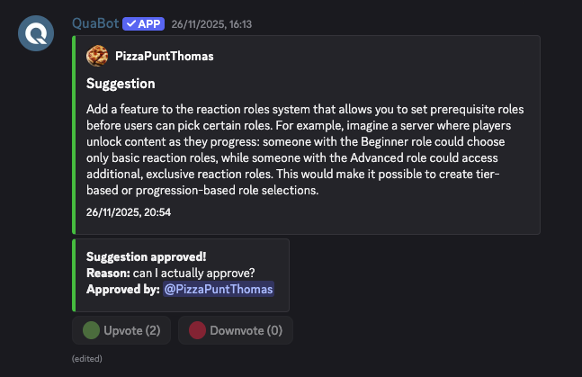
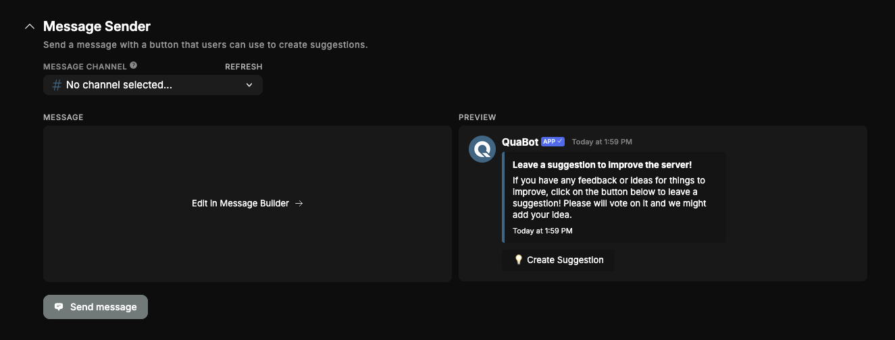
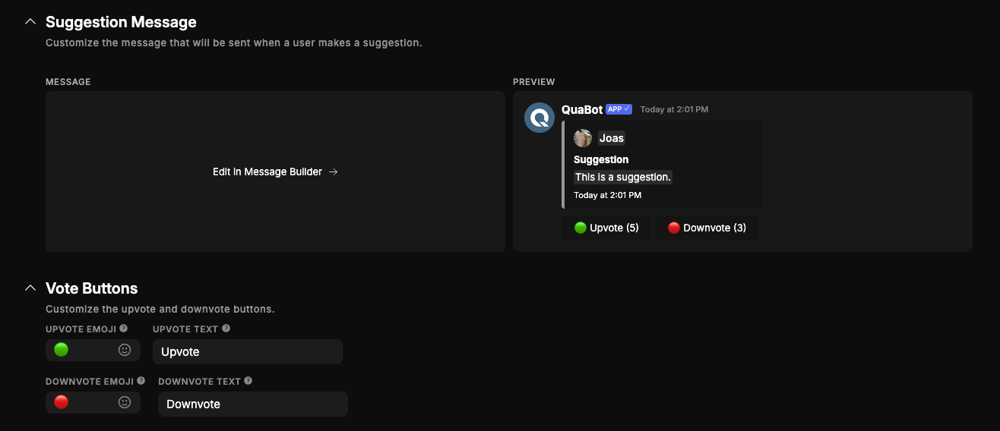
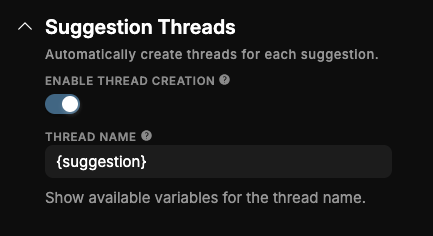
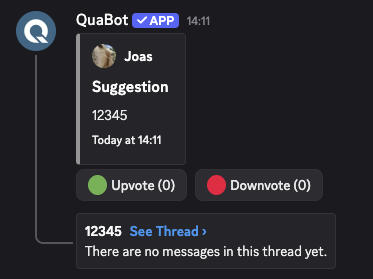
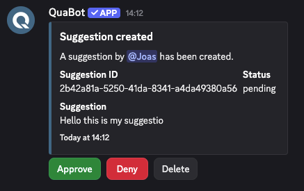
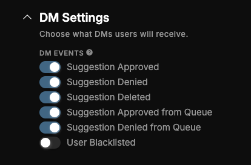
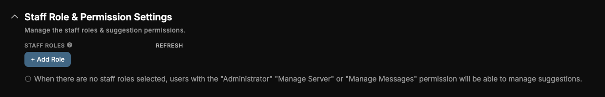
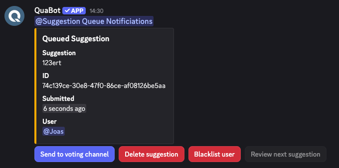

# Suggestions

Let users suggest their ideas and vote on them. Easily manage and implement the most popular suggestions in your server.

## Overview

The suggestions module allows users to suggest ideas or features that other users in your server can vote on. The module is fully customizable. In this guide we will go over each feature in detail and explain how they work.

## How does it work?

### Creating Suggestions

There are multiple ways to create suggestions! You can use the `/suggestion create` command, which will open a popup for you to enter your suggestion. You can also click the button on a pre-existing message to easily and effortlesly create a suggestion. After you create the suggestion, it will be sent into the Suggestions channel where other users can vote on it.

#### Message Sender

You can send a message to any channel using the Message Sender. This message will be fully customizable, and below it is a button that you can press to create a suggestion. This can be used as an alternative for the `/suggestion create` command.

#### Custom Messages

The message that is send to the suggestions channel, basically the suggestion itself is also customizable. You can customize the messag with multiple variables to display all the information you want. You can also change the Vote Buttons, the buttons below the suggestion. The emoji and text can be changed to your liking.

#### Suggestion Threads

You also have the option to automatically create a thread for a suggestion, that can be used to discuss the suggestion. You can customize the name with multiple variables.

#### Anonymous Suggestions

You can enable the suggestions system to be anonymous, so that users cannot be identified when they are creating their suggestions. **If this mode is enabled, we do not store and user identifiable data at all. So disabling the anonymous mode does not restore the user data.** Staff cannot see the user's name either.

### Votes

Users can vote on suggestions with the two buttons below the message.

**For premium servers:**
Use `/suggestion upvotes` and `/suggestion downvotes` to view the users that up/down voted the suggesion. For non-premium servers, there is only the total count.

### Logs & DMs

#### Logs

You can enable Suggestion logs to send suggestion related events in a seperate channel. These messages have the buttons to instantly approve, deny or delete any suggestion. When you click on these buttons you are prompted to give an (optional) reason. This allows you to easily moderate and manage suggestions without needing to use all the commands.

#### DMs

You can also choose what DMs users will get when their suggestions are updated. The following events are available:

- Suggestion Approved
- Suggestion Denied
- Suggestion Deleted
- Suggestion Approved from Queue
- Suggestion Denied from Queue
- User Blacklisted

You can find these settings under the 'Advanced Settings' tab.

### Staff Tools & Roles

#### Roles

Staff Roles define what roles are allowed to approve, deny and delete suggestions or blacklist users from the module. When there are no staff roles selected, users with the "Administrator" "Manage Server" or "Manage Messages" permission will be able to manage suggestions.

#### Blacklists

You can blacklist users from creating suggestions. This can be used if a user has created spammy or rule-breaking suggestions in the past. Simply run `/suggestion blacklist-add` and `/suggestion blacklist-remove` to add and remove users from the blacklist!

### Suggestion Queue

Lets say, you have a big server. There will be some users that create suggestions that are just inappropriate. The suggestion queue places suggestions in a queue, not visible to other users and will require staff to 'Approve' them, after which they are sent to the suggestions channel where users can vote on them. **This does not approve/deny the suggestion itself**. The suggestion can also simply be deleted, it will not be sent to the suggestions channel. What can you configure:

- **Queue Type:** Virtual or Channel. **Channel** mode sends queued suggestions to a channel for staff to vote on, **Virtual** mode is only visible with `/suggestion queue`, requiring regular checks. This will walk you through all queued suggestions.
- **Queue Channel**: If set to channel mode, this is the channel that queued suggestions are sent to.
- **Mentioned Queue Roles**: The roles that are pinged whenever a suggestion enters the queue, ensuring fast review from staff.
- **Max Queue Size:** The maximum amount of queued suggestions allowed at once.

You can also easily blacklist users from the queue, all options are seen below.

## Commands

You can enable or disable specific commands at the Commands tab. If a command is disabled, nobody, including admins, can use it. This module has the following commands that you can toggle on the dashboard:

- **/suggestion create** — Create a new suggestion.
- **/suggestion approve** _(suggestion_id, message_id, reason)_ — Approve a suggestion.
- **/suggestion deny** _(suggestion_id, message_id, reason)_ — Deny a suggestion.
- **/suggestion delete** _(suggestion_id, message_id, reason)_ — Delete a suggestion.
- **/suggestion upvotes** _(suggestion_id, message_id)_ — View all upvotes for a suggestion. _(Premium only)_
- **/suggestion downvotes** _(suggestion_id, message_id)_ — View all downvotes for a suggestion. _(Premium only)_
- **/suggestion queue** — Review all queued suggestions.
- **/suggestion blacklist-add** _(user, reason)_ — Add a user to the blacklist.
- **/suggestion blacklist-remove** _(user)_ — Remove a user from the blacklist.

## Frequently Asked Questions

### **Why are my suggestions not appearing in the Suggestions channel?**

This usually happens when **Queue Mode** is enabled. Suggestions must be manually _approved_ by staff before being published. Check under **Advanced Settings → Suggestion Queue** to change this behavior.

### **Why can't users see who voted on a suggestion?**

Vote details (lists of users who upvoted/downvoted) are **Premium-only** features. Non-premium servers can only view total counts.

### **My staff can’t approve or deny suggestions — why?**

Ensure that staff have at least one configured **Staff Role**, or they need one of these Discord permissions:

- **Administrator**
- **Manage Server**
- **Manage Messages**

### **What happens if I enable Anonymous Suggestions?**

No identifiable user data is stored at all. Even staff cannot view who created a suggestion. Turning anonymous mode off later does _not_ restore user identity for old suggestions.

### **Why are suggestions going straight into the queue?**

Your **Queue Mode** is set to either _Virtual_ or _Channel_. In both modes, suggestions must be reviewed and approved by staff before becoming visible.

### **Does deleting a suggestion remove its votes and thread?**

Yes — deleting a suggestion removes:

- The suggestion message
- All vote buttons
- Any associated discussion thread
- All stored vote data

### **Can I customize the Vote Buttons?**

Yes — both the **emoji** and the **text** of the upvote/downvote buttons can be customized from the dashboard under **Custom Messages**.

### **How do I stop spam or troll suggestions?**

Use the built-in blacklist system:

- `/suggestion blacklist-add`
- `/suggestion blacklist-remove`
  This prevents problematic users from creating new suggestions.

## Need Help?

Join our [Discord server](https://discord.quabot.net) for support, bug reports, and setup help.
