# Tickets

Using our advanced tickets module you can handle support questions with form-like-questions, automatic role assignments and customizable messages.

## Overview

Tickets are the perfect way to handle support and questions people have. Users can create a private support ticket, a private channell, to talk with support. Support teams have a varietey of advanced tools and automations at their disposal to make managing this ticket as easy as possible. In this article, we will go over each functionality of the Tickets module and explain how they work and what they do. Let's get started!

## How does it work?

A user can create a Ticket, that will then be answered and helped by support teams. Support members can claim their tickets, close tickets, delete tickets, download transcripts and more. Let's dive in!

### Panels

The Tickets module is subdivided into panels. To even create a ticket, you need a support ticket panel. But, what is a panel? A panel can be viewed as a configuration, each panel has it's own staff team, channels, rules and settings. A panel can have a message in a dedicated channel with a way (button, dropdown etc.) for the user to create their tickets. We will go over this in more detail below. Tickets can also be created with a command. When the ticket is created, a channel is created in the panel's ticket category, that will have the staff team, the user and various buttons to manage the ticket. Let's dive into panel messages first.

#### Panel Messages

Panel Messages are messages in dedicated channels that users use to create tickets. They always have a component that is used to create a ticket. If there is no message, the user can use `/ticket create` to create a ticket for a panel. If enabled, the panel will show up in a list for the user to choose from. The user will still have to complete any forms or pick their topic as outlined below.

#### Panel Types

##### Forms

When the form mode is enabled, the message (or command) will show the user a form with a number of questions to answer. The form has a name and description that is shown to the user before they start answering their questions.

The user can click next and the form will begin. You can add as many questions as you'd like. Each question takes a couple of values to work. You can customize the question, add a short description and choose the type of questions. You can choose the following types:

- **Short Answer:** Answer is short, up to 100 characters.
- **Paragraph Answer:** Answer is longer, with multiple lines up to 500 characters.
- **Yes/No:** User must choose between Yes/No as an answer.
- **Multiple Choice:** User needs to pick one out of the options.
- **Checkboxes:** User can pick as many as they want out of the options.

For the last two, you can add custom options (up to 20!). You can make a question required or have it be set as the ticket topic. If the latter is enabled, all the answers from the form that have that enabled will be combined and that will be the ticket's topic!

All questions are answered in modals. Users can simply press submit on their popup and the answer is saved!

You can view the Form Answers after the ticket is created. A button is available for staff on the start message to press, which will cycle through all of the answers to that form. The form can be used to give additional context to a ticket and to help the user even better with their inquiry.

> _Question Picker, Form Start, Form Modal and Form Submit:_

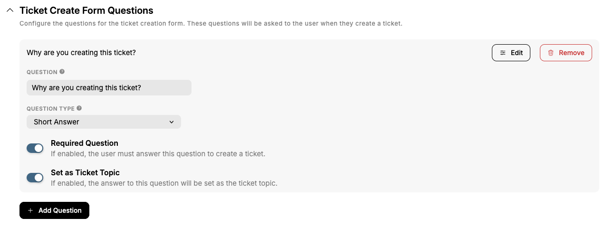
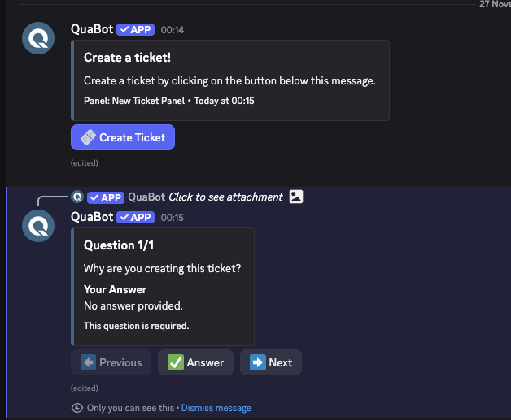
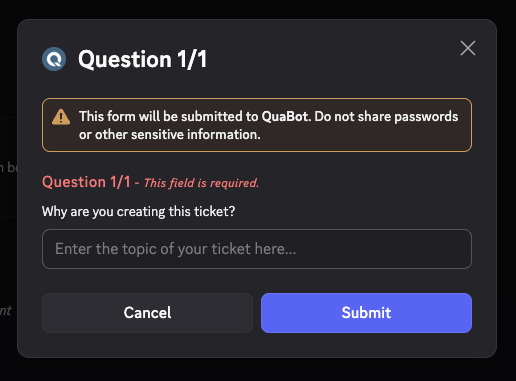
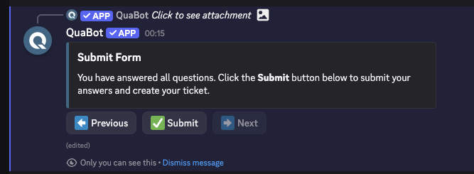

##### Dropdown

With the dropdown, you create a list of pre-defined topics the user needs to choose from to create their ticket. You can add up to 20 different topics to choose from! You can choose the Action Type on the Edit Panel page. You can customize the Dropdown Placeholder, minimum required and maximum required options. If multiple options are selected, they are combined to the ticket topic.

Each option needs a name, description and a value. The value is what is used for the ticket topic. You might want this to be somthing different than the name, which is what is shown to the user. You can also add an optional emoji to be shown, this can be a custom emoji from your server.

The dropdown will show below the panel message, allowing users to simply pick their options and create the ticket!

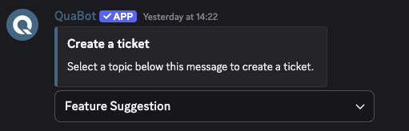

##### Button

The button is most straight forward of them all. You can have a button below the panel message. When the user clicks, a popup will open for the user to enter their own ticket topic. You can have this be a required value or optional.

The button can be customized! Change the color, text and emoji to anything you'd like. The emoji is optional and can be a custom server emoji.

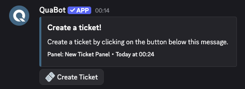

### Support Teams & Permissions

The Tickets need to be answered by someone! That's where the support team comes into play. They are the ones that answer the ticket and manage it. They can add roles, claim it, delete it and everything they want! Let's go over permissions & staff teams in detail.

#### Support & Observer Teams

The ticket is mainly managed by the **support team**. You can choose any number of roles to be a part of this team. They will always be added to new tickets, and are the only ones that can claim, unclaim and add/remove roles from tickets. If enabled, they are also the only ones that can delete or add users to tickets. This is not enabled by default. The support team completely handles the ticket. Staff cannot speak in a closed ticket. **In this article, staff team and support team are mixed, they mean the same thing.**

The **observer team** is a team of roles that are added to the ticket, but cannot speak. They are mainly there to observe and view the tickets. They are always added to the ticket, but can only read messages.

#### Permissions

By default users (not support teams) can do the following in their tickets:

- Add/Remove Users
- Close/Reopen
- Request a Transcript
- Delete
- Rename
- Change topic

Staff teams can do the following:

- Add/Remove roles
- Transfer/Escalate
- Claim/Unclaim

You can enable the option to allow only staff members to add/remove users to and from tickets.

Most permissions for actions (such as close, delete, claim etc.) can be customized and have the following settings:

- **Support Only:** Only the support team can do the action.
- **Added Users Blocked:** Blocks users that are not staff or ticket owners from using this.
- **Allowed Roles:** Roles that can perform the action. (Support team only & Added Users Blocked restrictions still apply)
- **Blocked Roles:** Roles that **cannot** perform the action. (Support team only & Added Users Blocked restrictions still apply)

Some cannot be changed such as escalate, these actions are, and will remain, staff only. The permissions also automatically apply to the buttons, and can be configured on the buttons page too.

There are also panel-level allowed and blocked roles. These are required or blocked from creating tickets in that panel.

#### (Staff) Threads

You can also create a thread when a ticket is created! Each thread has a custom name and you can enable the following features:

- Automatically add Staff Team to thread to automatically add staff team.
- Support Team only: restrict talking permissions to staff team members only. (It prevents Send messages in threads for regular users).

#### Staff Pings

You can enable staff pings. This will automically send a seperate message is created (custom message) that will ping the staff team. You need to configure the roles to ping seperately (for example, not every staff member wants to be pinged).

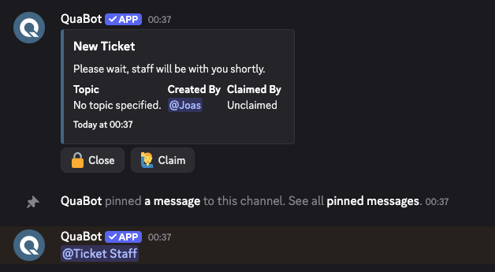

### Ticket Actions

Managing a ticket is done through a set of powerful actions. These actions allow staff teams (and in some cases users) to resolve, escalate, or organize tickets in an efficient way. Each action has dedicated permissions, logging, and optional DM notifications.

#### Claiming Tickets

Claiming a ticket allows a staff member to take ownership of it.  
Once claimed, the ticket will show who is currently responsible. Other staff members can still reply, but the claim helps keep things organized.

When enabled, claiming will:

- Mark the ticket as _claimed_.
- Display a “claimed by” field in the message.
- Optionally send a DM to the claimer.
- Allow unclaiming at any moment.

There are a few additional settings available for claiming:

- **Claim name:** change the channel name when the ticket is claimed.
- **Claim category:** change the category when the ticket is claimed.
- **Overwrite claims**: other staff members can overwrite if a ticket is claimed to claim it themselves. If disabled, the ticket needs to be unclaimed first.
- **Everyone can unclaim:** if enabled, all staff members can unclaim a ticket for the claimer. Otherwise only the person that claimed a ticket can unclaim it.

All messages related to claiming tickets can be edited!

#### Closing Tickets

- Closing a ticket archives it, preventing users from talking while keeping it visible for staff.
- The ticket will be moved to the closed tickets category, and if enabled the name will be changed too.
- After a ticket has been closed, the action message is sent with buttons to delete, reopen or get the transcript.
- **Two Step Close** requires the user to confirm that they _really_ want to close the ticket! This message can be customized.
- Staff can close tickets, but users can also close their own tickets if they feel their question has been answered.

#### Close Requests

Close Requests allow staff to politely request the user to confirm or deny closing their ticket. The staff member requests a close, which will ping the ticket owner and give them the option to **Close** or **Not close** the ticket. The ticket owner will also receive a DM.

- If **accepted**, the ticket closes automatically.
- If **ignored** the ticket is also closed.
- If **denied**, the ticket is not closed.

You can customize when a close request expires on the panel configuration. This is chosen per panel and not per request.

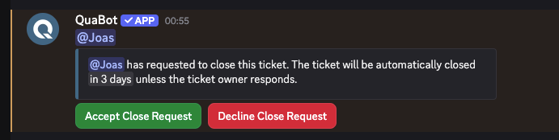

#### Deleting Tickets

Deleting removes the channel entirely. This is permanent. If two step delete is enabled, the user needs to confirm to delete the ticket, since it cannot be reverted. Anyone can delete a ticket, as long as the option "Staff only Delete Tickets" is disabled.

⚠️ The ticket needs to be closed before it can be deleted.

#### Transfer & Escalate

Transfer and Escalate allow staff to move a ticket from one panel to another. This allows another team of staff members to pick up the ticket! Each panel needs to choose what panels the tickets can be moved into. If no panels are chosen, all panels are available. On ticket move, you can have the following be updated:

- Channel Name (based on new panel settings)
- Channel Permissions (based on new panel settings)
- Channel Category (based on new panel settings)

The staff member runs `/ticket escalate` or `/ticket transfer`, and a dropdown to choose the new panel appears.

You can also have the new panel's start message be sent, if that differs from the other one. You can also send a **custom** transfer/escalate message. It will send the old panel's transfer/escalate message in the ticket.

### Logs & DMs

#### Logs

You can have different ticket events be logged into a dedicated ticket logs channel! You can log the following:

- Ticket Created
- Ticket Deleted
- Ticket Closed
- Ticket Reopened
- Transcript Sent (including transcript)
- Ticket Updated (Topic Changed or Renamed)
- Ticket Claimed
- Ticket Unclaimed
- Ticket Escalated
- Ticket Transferred
- Ticket Close Requested
- User Added to Ticket
- User Removed from Ticket
- Role Added to Ticket
- Role Removed from Ticket

You need to **enable** and configure the **log channel** before events are logged into the channel. They are not saved in our database so it's completely local.

#### DMs

If a user has DMs enabled, you can choose what events and things are sent to the user in DM when they happen. You can send the following things:

- Ticket Created
- Ticket Deleted
- Ticket Closed
- Ticket Reopened
- Transcript Sent (including transcript)
- Ticket Claimed
- Ticket Unclaimed
- Ticket Escalated
- Ticket Transferred
- User Added to Ticket
- User Removed from Ticket

You can customize every message that the bot sends the user via DM.

### Transcripts

Transcripts allow you to export the full ticket conversation in a beautiful Discord‑style format to an HTML file.

Supported features:

- Embeds
- Buttons
- Reactions
- Threads
- Pinned messages

Transcripts can be:

- Downloaded via `/ticket transcript`
- Generated automatically on close/delete.
- Logged to the transcript channel.

If they are logged, every generated transcript will be sent into that channel.

:::note Viewing Transcripts
In order to view a transcript, download the file and open it. It should open with Discord-style formatting (unknown if mobile supports this). At this time, we do not store or upload transcripts to be viewed on our Dashboard. This is something we are actively looking into and we will keep you updated.
:::

### Automation & Limits

The Tickets module includes automation tools to reduce manual work and keep your ticket count reduced to a minimum.

#### Auto Close

Automatically closes tickets after a period of inactivity.

You can choose after what amount of time a ticket is automatically closed. If there is no message within this time, the ticket is closed.

#### Auto Remind

Sends reminder messages when a ticket is inactive but not yet ready to auto‑close.

You can choose any interval (and multiple intervals) and after the last message is sent, whenever an interval passes, staff and users are reminded that the ticket has gone inactive.

#### Limits & Cooldowns

To avoid spam and abuse, panels can have:

- Ticket creation limits per user, this can be customized to prevent spam. The defaut is 10 minutes.
- Cooldowns between ticket actions (close, reopen, claim, rename, transfer, escalate). These limits cannot be changed due to Discord ratelimts.
- **Max open tickets per user:** the max amount of open tickets the user can have for that panel.
- **Max open ticket per panel:** the max amount of open tickets the panel can have.
- **Max closed tickets per user:** the max amount of closed tickets the user can have for that panel.
- **Max closed ticket per panel:** the max amount of closed tickets the panel can have.

#### Auto Roles

Automatically assign and remove roles when tickets open or close. You can choose what roles are added or removed when it opens, and when it closes. These roles are only assigned to the ticket owner. You can add or remove multiple roles at once.

**Example:**

- User opens a ticket: Add 'Support Needed' role and remove 'No Support Needed'
- User closes a ticket: Add 'Helped' and 'No Support Needed' and remove 'Support Needed' and 'Ticket Log access'

#### Owner Leaves Server

If a ticket owner leaves the server, the panel can be configured to:

- Auto‑close the ticket
- Send a message
- Delete the ticket entirely

You can enable any number of these events!

### Customization

Every part of the ticket system is customizable.

#### Messages

Every ticket action message can be customized:

- Start Message
- Close Confirm Message
- Delete Confirm Message
- Closed Message
- (Re)Opened Message
- Staff Ping Message
- Claimed / Unclaimed Message
- Escalate / Transfer Messages
- Actions After Close Message

All support variables (such as `{ticket.topic}`, `{owner}`, `{claim.user}`) are fully supported. You can view the list on the Message Builder as explained in its [guide](../embed-builder.md).

#### Buttons

Each button can be fully customized:

- Text, style, emoji
- Required permissions
- Allowed / Blocked roles
- Support‑only mode
- Added-users blocked

Cooldowns also apply for buttons.

## Configuring the module

We will quickly glance over the way to configure the tickets module. First of all; you can toggle tickets entirely on the tickets configuration page. Let's get started!

### Creating a Ticket Panel

1. Create a ticket panel by clicking "+ Create Ticket Panel" in the "Ticket Panels" section.

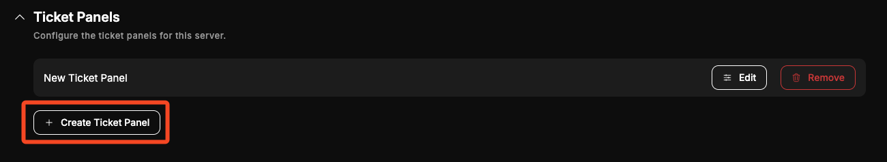

2. Choose the ticket categories (where channels will be created/moved to) and the names for ticket channels. Each option is explained in the tooltip. Click "Next" when done.

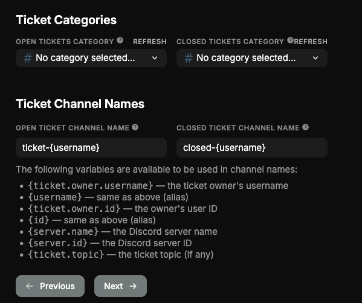

3. Choose the [staff and observer roles](#support--observer-teams). Choose what roles you want in that team, or don't choose any. When ready, click "Next".

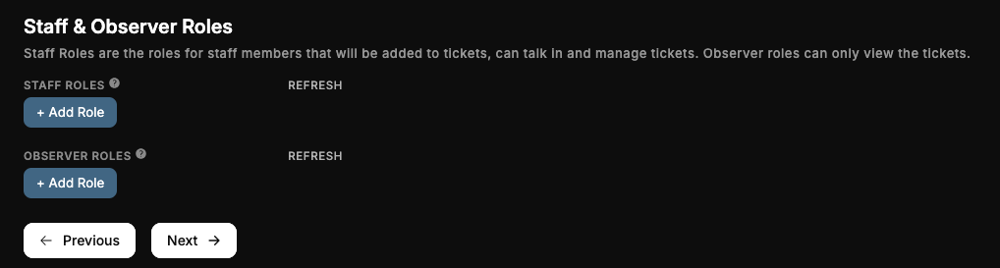

4. Choose if you want [ticket claiming](#claiming-tickets) enabled.

5. Toggle [Ticket Logs](#logs) & [Transcripts](#transcripts). When you enable one of them, you need to choose the channel as well.

6. Select the [DM events](#dms) you want the user to get. Not all events are shown here for simplicity's sake.

7. Customize the [panel message](#panel-messages).

8. Give your panel a name, send the panel to a channel if you want and save the panel! Read through the next steps on this page to see what you can do next.

You've now created your ticket panel! Congratulations.

### Editing a Ticket Panel

In the list of panels, click "Edit" to open the edit page for a panel.

- Configure the basic settings to quickly toggle a panel, change it's name or access frequently used settings.
  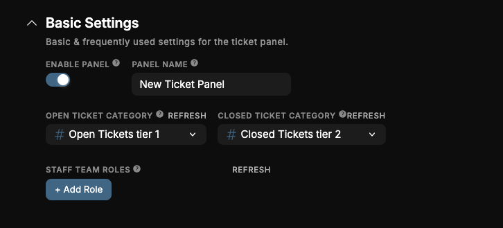
- You can search the pages and settings for what you want with the search bar.
- All settings are grouped per category (General/Panel/Advanced). All settings are explained in the sections above in this page, or using the tooltips and descriptions.

Don't forget to save your changes!

## Feedback System

You can get feedback about your support teams when a ticket is closed! The user will get a message, asking them to give their experience a score from 1-10, with an (optional) reason. On the Feedback Settings tab, you can configure the following:

- **Enable Feedback:** Prompt the user to give feedback when a ticket is closed.
- **Anonymous Feedback:** Users can submit feedback without showing their username to the staff team.
- **Feedback Reason:** Require the user to give a reason for giving the score.
- **Feedback Type:** Choose if the user gets the feedback request via DM or in the ticket channel.
- **Feedback Log Channel:** The feedback can be logged to this channel to quickly review the feedback.

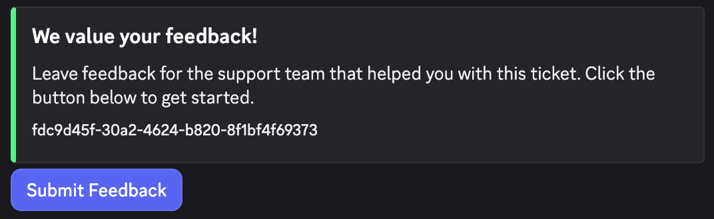

Use `/ticket feedback` to get the average score, the percentages and more information about the given feedback. We are working on a way to get even more insights, view which staff team members get which scores and more. This is coming in a future update.

## Commands

QuaBot includes a full suite of ticket management commands. Every button is available as a command as well. Some commands can only be used by staff members, depending on your permissions and panel configuration.

You can enable or disable specific commands at the Commands tab. If a command is disabled, nobody, including admins, can use it. This module has the following commands that you can toggle on the dashboard:

#### `/ticket create`

Create a new ticket.
If multiple panels are available, the user will be prompted to pick one.
The user will then complete a form, choose a topic, or enter a custom topic depending on the panel configuration.

#### `/ticket close`

Close the current ticket.
If **Two Step Close** is enabled, the user must confirm the close request.

#### `/ticket close-request`

Send a close request to the ticket owner.
The owner can choose to accept or deny the request. If ignored, the ticket will automatically close when the request expires.

#### `/ticket reopen`

Reopen a previously closed ticket.

#### `/ticket delete`

Delete the ticket permanently.
If **Two Step Delete** is enabled, confirmation is required.
⚠️ The ticket must be closed before deleting it.

#### `/ticket claim`

Claim the ticket.
The ticket will show who is currently handling it, and optional claim settings (renaming, recategorizing) will be applied.

#### `/ticket unclaim`

Remove the claim from the ticket.
Depending on the panel settings, only the claimer or all staff members may unclaim.

#### `/ticket add <user>`

Add a user to the ticket.
This gives them access to the ticket channel.

#### `/ticket remove <user>`

Remove a user from the ticket.
They will lose access to the ticket channel.

#### `/ticket add-role <role>`

Add a role to the ticket. Staff-only command.

#### `/ticket remove-role <role>`

Remove a role from the ticket. Staff-only command.

#### `/ticket transcript [ticket]`

Generate a transcript of the ticket.
If no ticket is provided, the current channel is used.

#### `/ticket escalate`

Escalate the ticket to another panel.
A dropdown will appear with all available panels to escalate to.

#### `/ticket transfer`

Transfer the ticket to another panel.
Just like escalate, but without implying urgency or priority change.

#### `/ticket stats [ticket]`

Get detailed statistics about a ticket.
Includes timestamps, activity information, claim history and more.

#### `/ticket rename <name>`

Rename the ticket’s channel. Staff-only command.

#### `/ticket info [ticket]`

Show detailed information about the ticket.
Useful for checking ownership, topic, panel, claims, and timestamps.

#### `/ticket topic <topic>`

Change the ticket’s topic.

#### `/ticket setup`

Guided setup to create a fully-working ticket panel with default settings.
Useful for beginners or quick configurations.

## Frequently Asked Questions

### **What are Ticket Panels?**

A panel can be viewed as a configuration, each panel has it's own staff team, channels, rules and settings. A panel can have a message in a dedicated channel with a way (button, dropdown etc.) for the user to create their tickets. More info can be found at the [Panels Section](#panels).

### **Why is my channel name/category/permissions not changing?**

The bot might have reached a ratelimit or has no [permisisons](../permissions.md) to update channels.

### **Tickets are not being created!**

The bot might have reached a ratelimit or has no [permisisons](../permissions.md) to update channels.

### **Users can't create tickets!**

Make sure a panel message exists, the panel is enabled, and the user isn’t blocked by limits such as max open tickets or cooldowns. Also check if the user has permission to view and use the panel message.

### **Why can't staff claim/unclaim tickets?**

Claiming may be disabled in the panel, the staff role may not be in the support team, or “Everyone can unclaim” may be disabled. If overwrite claiming is off, a ticket must be unclaimed first.

### **Why are my transcripts downloading as raw HTML?**

Transcripts always download as `.html` files for safety reasons. To view them properly, open the file in a desktop browser. Discord and some mobile browsers cannot render transcripts directly.

### **Why can't users delete or close tickets?**

The action might be restricted to staff, blocked for non-owners, or they do not have the required or blocked roles. Configure this on the "Permissions" tab.

### **My ticket channels appear in the wrong category!**

The configured categories may have been deleted or renamed, or the bot may lack Manage Channels permissions. Re-select the category and re-save the panel settings.

### **Why don't logs or DMs appear?**

A log/DM event must be enabled, and a log channel must be selected. Users may also have DMs disabled. The bot must have permission to send messages in the log channel. Some events are simply not logged at this time, such as Transfers in some cases.

### **Can tickets auto-close or remind users automatically?**

Yes, using Auto Close and Auto Remind features. Both can be configured per panel under Automation & Limits.

### **Why can't users submit form answers?**

This usually happens when the modal was closed or dismissed before submitting. It should still work when you try to answer again. Ensure your form questions are valid, required questions are answered.

### **Why does Discord say “Interaction failed” when creating a ticket?**

The bot may be restarting, updating, slow to respond, or hit a Discord ratelimit. Try again after a few seconds. If it persists, check our [status](https://status.quabot.net).

### **Why are some buttons missing in my ticket?**

The panel configuration may have disabled specific actions, or the button’s permissions block the current user. Check the Allowed/Blocked roles or Staff-only settings.

### **Can staff see form answers after a panel change or transfer?**

Yes. Form answers are stored inside the ticket and travel with it, even when transferred to another panel.

## Need Help?

Join our [Discord server](https://discord.quabot.net) for support, bug reports, and setup help.
