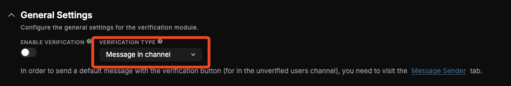
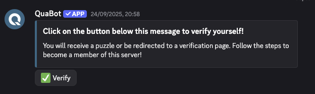
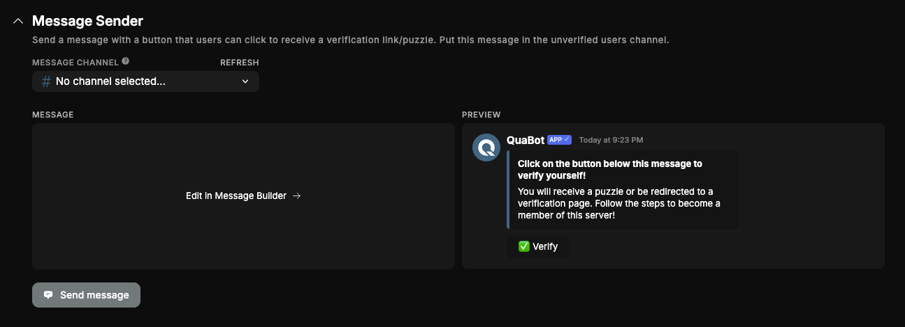
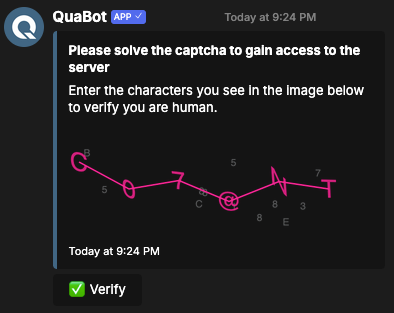
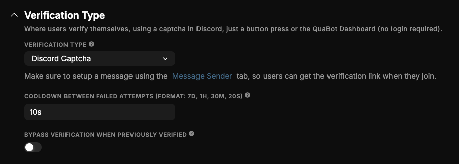
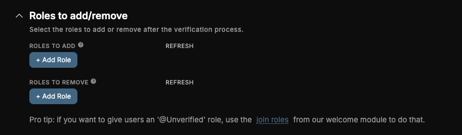
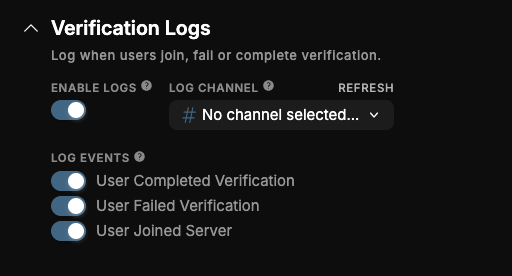
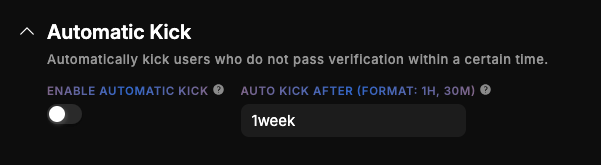

# Verification

Secure your server by requiring new members to complete a captcha to gain access, preventing bots and raids.

## Overview

Your server might face threats from time to time. Massive influx of users suddenly joining, all of them botted acounts ready to spam your server. That's where our verification module comes in. This module can block most of those bots, since they will need to verify themselves before they get the roles to talk! We'll go over everything in detail below.

## How does it work?

The bot will, when they join send them either a dm, or the users can already view a channel with a message in it. Using this message or that DM they can get the roles to talk in other channels. This can be done simply by pressing the button, completing a Discord catpcha or a captcha on the QuaBot Dashboard (which requires login). We'll go over every setting below, but that's the simple gist of it.

### Server Setup

First we're gonna talk about how you need to configure your server. There are a couple of basic principles you need to follow:

- **You must remove the Send Messages permission from @everyone**. (Either globally or per-channel) This is to ensure non-verified users **cannot** send messages in channels. You can also remove the Read Message History or View Channels to ensure bot accounts wont read the server's messages without being verified.
- **Another role for verified users must have Send Messages permission**. (Either globally or per-channel) This role will be given to verified users, and they can then send messages. If you also denied View channels or Read Message History -> enable this too for that role.

If you've done this, your server will not be viewable for un-verified members, and people who _are_ verified are able to view the server. This is to ensure proper verification. Let's go and talk about the verification message and the way verification works for users.

### Verification Message

When the user joins your server, they need to know how to get verified. QuaBot can send a message with a button. When that button is pressed, the user will start the verification process. There are a few options for this message:

- **Send a DM**: QuaBot can send the user a DM that will have the Verify button. This DM is fully custom.
- **Message in channel**: One of the channels in your server can act as the verification channel. This will have a pre-sent message, with a button the user can click to verify themselves.
- **Both**: Send both a DM and have a message in the channel.

:::danger
**Please note that not everyone has DMs enabled, and we recommend to offer both methods if you want a DM!**
The option for DMs only will be removed in a future update.
:::

The message can be sent on the "Message Sender" tab.

### Verification Type

There are 3 ways for users to verify themselves after clicking the button:

#### Discord Captcha

The bot can send the user a private Captcha, where they must enter all the characters in a text field and if it's correct; they're verified! If they fail, they get to try again. [More info](#additional-settings)

#### Button Click to verify

This will verify the user immediately when they click the button! They will be given the roles.

#### Dashboard Captcha

This will give the user a link to the QuaBot dashboard. There, they need to login, and solve an hCaptcha, which is more secure than the Discord one but less convinient for the user. This is a secure system with private codes and keys for users.

#### Additional Settings

You can change some additional settings:

- **Cooldown between failed attempts**: When a user fails, it is saved as an attempt. Use this to give the user a cooldown to prevent users trying too many times.
- **Bypass verification when previously verified**: When a user joined before and has been verified already, they can simply skip verification.

### Roles

You can configure a list of roles to add and a list of roles to remove when the user is verified.

### Logs

Under the Advanced Settings there is the option to Enable **Verification Logs** to automatically log and store when a user fails or completes verification or joins the server. Configure the following:

- **Log Channel**: Where the log messages are sent
- **Log Events**: Choose from Complete Verification, Failed Verifiation and Joined Server. Log the enabled events.

### Automatic Kick (Premium)

If you have premium, you can enable auto kick. This allows you to automatically kick users that have not verified themselves within a defined time.

### Statistics

The statistics give you the following data:

- A list of verified users
- A list of unverfied users
- A pie chart showing the amount of verified and unverified users, as well as an average attempts statistic.

This is only on the dashboard at this time and we are looking into adding these statistics on the bot side as well.

## Frequently Asked Questions

### **Why are some users not receiving the DM to verify?**

Many users have **DMs disabled** for server members. Always provide a **channel verification option** to avoid this issue.

### **Do users need to verify again if they leave and rejoin?**

Only if you disable **Bypass verification when previously verified**. When enabled, returning users are automatically trusted.

### **Can bots bypass verification?**

No. QuaBot does **not** verify bot accounts, and bots cannot complete captchas. Ensure you do not give bots the Verified role manually unless intended.

### **Why can unverified users still see some channels?**

This happens when **@everyone** still has permissions like _View Channels_ or _Read Message History_. Remove these permissions and give them only to your Verified role.

### **What happens when a user fails the captcha too many times?**

They will be temporarily blocked based on your **failed attempts cooldown** setting. This prevents spam attempts or automated attacks. We are working on an auto-kick after too many failed attempts.

### **Can I customize the verification messages?**

Yes. All DM and channel messages (including embeds and titles) are fully customizable in the dashboard.

### **Does Dashboard Captcha require login?**

Yes. Users must authenticate with Discord before completing the hCaptcha. Their identity is confirmed securely as we always do on the QuaBot Dashboard.

### **Does Auto Kick delete the user’s messages?**

No. Auto Kick removes the member after the configured time but does not delete messages. Server moderation settings apply normally.

### **Can verification slow down raids?**

Yes — requiring a captcha drastically slows automated joins and blocks most bots. Auto Kick further prevents servers from being flooded with unverified accounts.

## Need Help?

Join our [Discord server](https://discord.quabot.net) for support, bug reports, and setup help.
