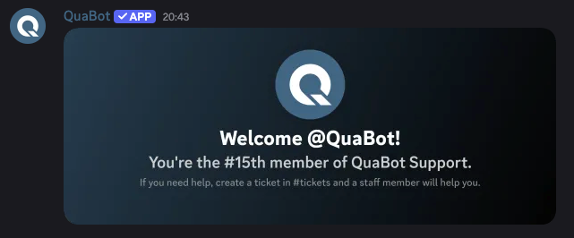
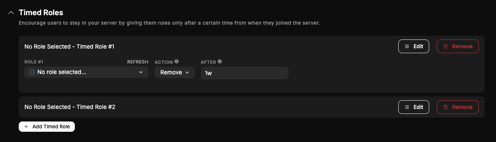
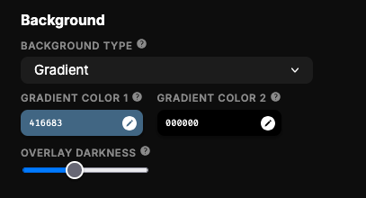
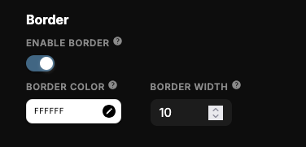
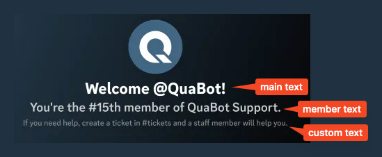

# Welcomer

Make your server members feel welcome with custom welcome messages, cards and timed roles to reward your members.

## Overview

The welcomer module is the perfect toolkit to welcome everyone to your server. Make them feel welcomed with custom DMs, messages and assign them roles. Let's go over everything!

## How does it work?

### Join & Leave Messages

- **Join Messages**: When a user joins your server, QuaBot can send a custom message to any channel! This is to announe the user's join. This message supports variables, embeds and even a join card! Customize it all to your liking.
- **Leave Messages:** The same as join messages, except they send when a user leaves the server.
- **Join DMs:** Send the user a private DM (if possible) with a join card, and a fully custom mesage.

All these messages support variables to show the server's membercount, username and more! To learn more about the card builder visit the [welcome card builder section](#card-builder) below.

### Join Roles

Give any number of roles to users that join your server, to have all members with a members role. This can be used in conjunction with the [Verification Module](./verification.md).

### Timed Roles

You can give/remove roles to and from users a while after they joined with Timed Roles. You can add up to 10 timed roles and you can customize the following:

- The role to add/remove
- The action (Remove/Add)
- The after - after how long the role should be added/removed.

This can be used to give users more roles the longer they are in the server!

## Card Builder

The welcome card can be customized and configured in a lot of different ways! Let's go over it in detail.

You can change any of these settings, and they will be visible in the preview for the card builder.

### Background

There are 3 types of backgrounds:

- A gradient
- An image
- A solid color.

You can upload custom images and customize the gradient or solid colors.
You can also change the 'overlay darkness'. That is basically how dark the background should be. This helps with readability.

### Border

You can add a border around the card, that will be overlaid on top of text and images. This is optional.

If enabled, you can change the border color and width to really change it the way you want.

### Text

There are 3 texts:

- Main Text
- Member Text
- Custom Text
  Each one goes below each other.

Each of these has the following options:

- **Text**: The text itself, with variable support.
- **Text Weight**: The boldness of the text.
- **Text Color:** The color of the text.

The custom text has another setting, the **Small Text** option. This makes it smaller so it fits more text!

### Avatar Settings

And finally, you can have the avatar be rounded or square. This is a simple toggle.

### Additional Notes

:::caution Warning
The preview is not 100% accurate. We are always tweaking and updating this preview, but we recommend sending a test message to ensure it looks like you want it!
:::

You can also quickly set all the different card designs to the same one with the **Update DM & Leave Cards to Join Card Design** button. This is to make it easier and prevents having to tweak each setting multiple times.

## Frequently Asked Questions

### **Why are some users not receiving welcome DMs?**

Users may have DMs disabled for server members. QuaBot cannot override this.  
If a DM fails, the join message in the server will still send normally.

### **Can I customize the join card for each channel separately?**

No. Join, leave, and DM cards all use the card builder settings you configure in the dashboard.  
However, you _can_ use different messages per channel.

### **Why does my join card look slightly different than the preview?**

The preview is a close approximation, but the rendering engine differs slightly from Discord’s image generation.  
Always test with a real join to confirm your final design.

### **Can I use variables inside my welcome card text?**

Yes! Most variables work inside the text sections — username, server name, member count, and more. The full list is at the bottom of the join card builder.

## Need Help?

Join our [Discord server](https://discord.quabot.net) for support, bug reports, and setup help.
